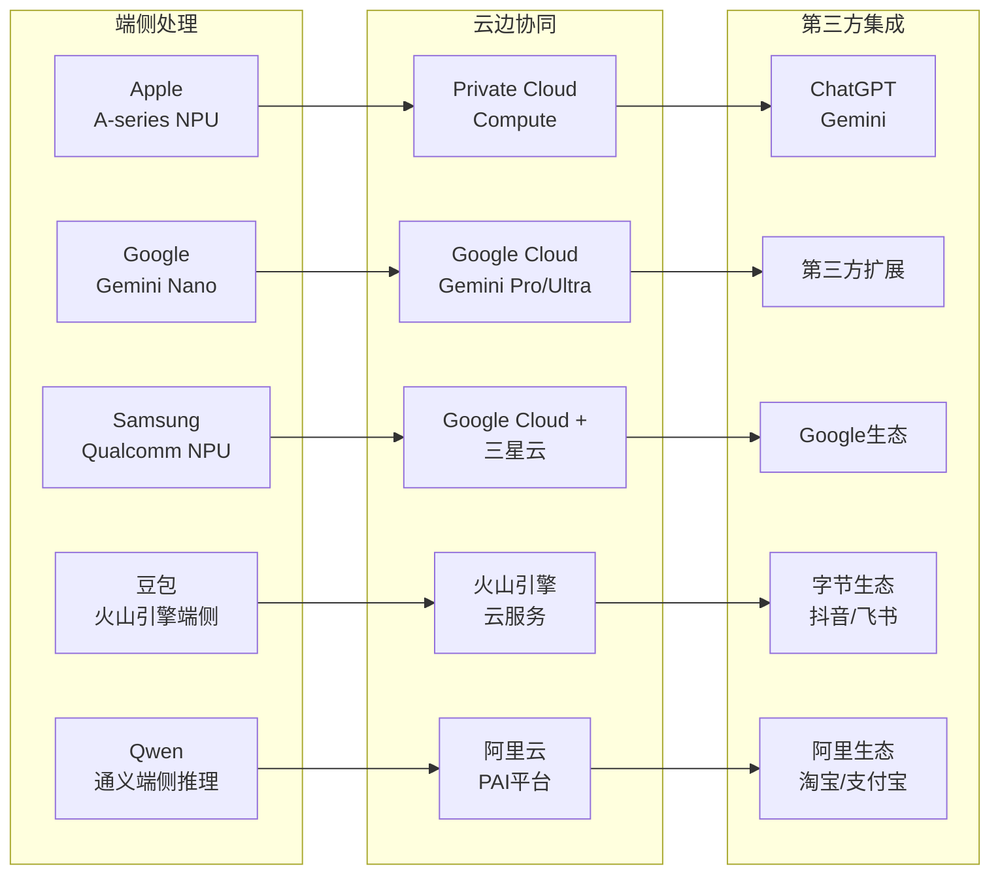
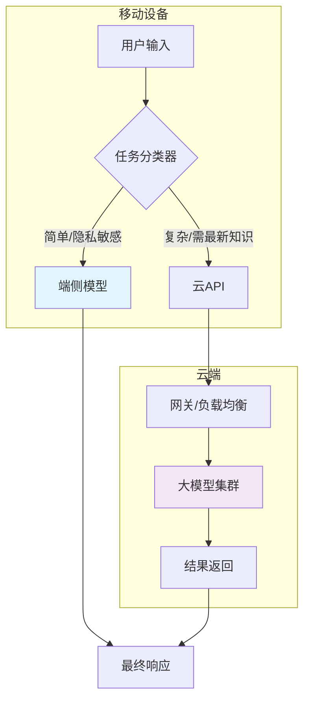
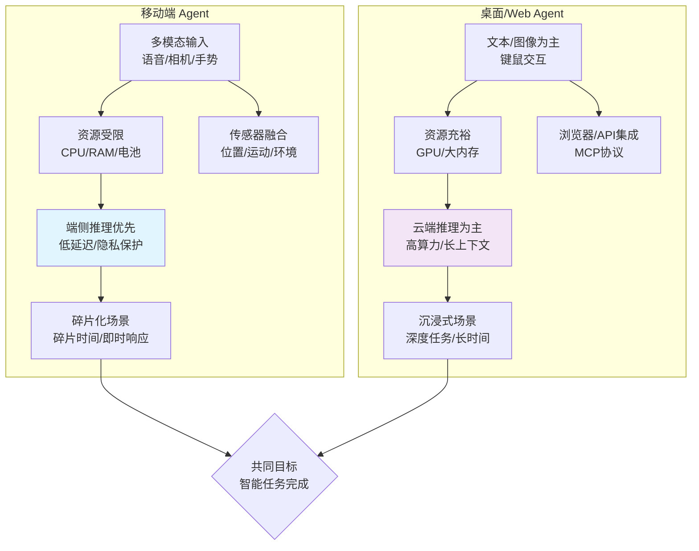

# 移动端 AI Agent 案例研究

## Executive Summary

随着大型语言模型（LLM）技术的成熟和移动端设备算力的提升，移动端AI Agent正从概念走向现实，成为科技巨头竞争的新焦点。本报告深入分析了移动端AI Agent的市场现状、核心产品案例、关键技术架构及商业模式。研究发现，Apple Intelligence、Google Gemini和Samsung Galaxy AI代表了当前移动端Agent的三大主流模式，它们通过**端云协同架构**平衡了隐私、延迟和算力挑战。中国市场中，豆包（Doubao）和通义千问（Qwen）等产品通过差异化功能和生态集成快速崛起。移动端Agent与桌面/Web Agent的核心差异在于**交互模态的丰富性**（语音、视觉、手势）、**资源约束**以及对**隐私保护**的极致要求。商业模式上，**硬件增值**和**生态锁定**是主要驱动力，纯粹的订阅制面临挑战。未来，端侧模型的轻量化、多模态融合以及Agent间的互联互通将是关键发展方向。

---

## 1. 引言与市场背景

### 1.1 移动端AI Agent的定义与演进
移动端AI Agent是指运行在智能手机、可穿戴设备等移动终端上，能够感知环境（通过传感器、用户输入等）、自主决策并执行任务以实现用户目标的智能软件实体[1]。其核心特征是**主动性**、**自主性**和**适应性**[2]。与传统的语音助手（如Siri、Google Assistant）相比，新一代Agent具备更强的推理、规划和跨应用操作能力。

### 1.2 市场驱动力
市场增长主要由三方面驱动：
1.  **技术突破**：端侧大模型（On-device LLM）的出现，如Apple的"Ajax"模型[3]和Google Gemini Nano[4]，使得在本地运行复杂AI成为可能。
2.  **硬件升级**：移动SoC中专用神经处理单元（NPU）的算力持续提升（如苹果A系列、高骁龙8 Gen系列）[12]。
3.  **用户需求**：对个性化、即时响应和隐私保护的需求日益增长[13]。
4.  **市场预测**：行业报告预测，到2025年，全球移动AI市场规模将达到数百亿美元[5]。

## 2. 核心产品案例分析

### 2.1 Apple Intelligence：隐私优先的端云协同典范
Apple Intelligence于2024年6月在WWDC发布，是苹果整合生成式AI的核心战略[3]。其架构采用**三层处理模式**：
- **端侧处理**：在设备上使用约30亿参数的模型处理日常任务（如文本校对、通知摘要），确保最低延迟和隐私。
- **Private Cloud Compute (PCC)**：当需要更大算力时，请求被发送到苹果专门构建的、具备硬件级安全隔离的私有云服务器[6]。
- **第三方模型集成**：复杂任务（如高级图像生成、编程辅助）可授权调用OpenAI的ChatGPT[7]。2026年初，苹果宣布与Google合作，将Gemini模型集成到下一代基础模型中，以增强Siri等能力[3]。

**关键功能**：写作工具、Genmoji自定义表情生成、照片清理工具、跨应用上下文感知操作。

### 2.2 Google Gemini：多模态与端侧部署的先行者
Google Gemini（原Bard）是Google的旗舰AI品牌，其移动端战略围绕**Gemini移动应用**和**Android系统深度集成**展开[4]。
- **端侧模型**：Gemini Nano预装在Pixel等设备上，支持离线处理（如摘要、智能回复）[8]。
- **云边协同**：通过"Gemini扩展"功能，在用户授权下安全地连接Google应用（Gmail、日历等）和第三方服务，执行跨应用工作流[4]。
- **多模态交互**：原生支持文本、代码、图像、音频和视频的混合输入与输出，使其在视觉搜索、实时翻译场景表现优异[4]。

**关键功能**：圈选搜索（Circle to Search）、实时对话翻译、Gemini Live语音交互。

### 2.3 Samsung Galaxy AI：硬件与AI的深度融合
Galaxy AI随Galaxy S24系列于2024年1月推出，其特点是将AI功能深度集成到三星的硬件和应用生态中[9]。
- **混合架构**：结合三星自研模型、Google Gemini模型以及高通等芯片合作伙伴的端侧AI能力[9]。
- **核心功能矩阵**：
    - **通信**：通话实时翻译、AI通话摘要。
    - **生产力**：笔记助手（摘要、格式化）、转录助手。
    - **创作**：圈选搜索、AI修图（生成式编辑）[9]。
- **生态整合**：与三星电视、手表、耳机等设备联动，提供跨设备AI体验。

### 2.4 中国市场的玩家：豆包与通义千问
- **豆包（Doubao）**：字节跳动推出的现象级产品，截至2024年11月拥有近6000万月活用户，位居中国AI聊天机器人首位[10]。其成功在于与抖音、飞书等字节生态的深度结合，以及强大的中文理解和内容生成能力。
- **通义千问（Qwen）**：阿里云开发的大模型家族，以开源策略（Apache 2.0许可）建立了强大的开发者生态[11]。其移动端应用深度集成淘宝、支付宝等阿里系服务，在电商、生活服务场景具备独特优势。
- **Kimi**：月之暗面（Moonshot AI）开发的AI助手，以超长上下文处理能力著称，在移动端提供深度文档分析和对话功能[15]。
- **Claude Mobile**：Anthropic将Claude模型的能力扩展到移动端，注重安全性与指令遵循[16]。

### 2.5 五大产品架构对比

**图 1: 五大产品架构对比（端侧 → 云端 → 第三方集成）**

## 3. 关键技术架构剖析

### 3.1 端侧模型（On-device LLM）
端侧模型是移动端Agent的基石，其核心挑战是在有限的存储（通常<10GB）、内存（<1GB）和算力（NPU）下实现可用性能。
- **模型压缩技术**：量化（INT4/INT8）、剪枝、知识蒸馏是主流方法。例如，Apple的30亿参数模型经过高度优化[3]。
- **专用硬件加速**：苹果Neural Engine、高通Hexagon DSP[12]、联发科APU为端侧推理提供硬件支持。
- **操作系统集成**：苹果的Core ML、谷歌的LiteRT（原NNAPI）为开发者提供统一的端侧AI接口。

### 3.2 云边协同架构
纯粹的端侧处理无法满足所有需求，云边协同成为必然选择。其核心设计原则是**任务智能路由**。

**图 2: 端云协同任务路由示意图**

延迟和隐私的平衡策略：
1.  **敏感数据不出设备**：生物识别信息、私人通信优先端侧处理。
2.  **分级响应机制**：端侧模型先给出快速初略响应，云端模型异步优化后更新。
3.  **联邦学习**：在不上传原始数据的前提下，利用云端聚合的模型更新改进端侧模型。

### 3.3 多模态交互框架
移动端Agent天然适合多模态交互，因为设备集成了麦克风、摄像头、陀螺仪等多种传感器。
- **视觉语言模型（VLM）**：如Qwen-VL[11]，可实现"以图搜图"、文档扫描解读。
- **语音交互**：流式语音识别（ASR）与语音合成（TTS）的结合，支持自然对话（如Gemini Live）。
- **情境感知**：利用设备传感器（位置、运动状态）和用户日历、邮件等上下文信息，提供主动建议。

## 4. 落地挑战与应对策略

### 4.1 隐私与数据安全
这是移动端Agent面临的最大挑战。苹果的**Private Cloud Compute**是目前最先进的解决方案[6]：
- **无状态计算**：服务器处理完请求后立即丢弃所有数据和临时文件。
- **可验证的安全**：硬件加密、内存隔离，并允许独立第三方审计其安全声明。
- **透明日志**：所有数据访问记录在不可篡改的公开日志中。

### 4.2 算力与能耗限制
移动端电池和散热限制了AI负载的持续运行。
- **动态批处理与缓存**：合并短时间内相似请求，缓存高频结果。
- **异构计算**：合理分配任务到CPU、GPU、NPU，以最优能效比完成计算。
- **云端卸载**：将训练和重型推理任务卸载到云端，端侧只负责轻量推理和结果呈现。

### 4.3 网络依赖与离线能力
网络不稳定影响云端功能。解决方案包括：
- **渐进式功能降级**：网络差时，自动切换到端侧模型或提供离线基础功能。
- **模型预加载**：预测用户可能需要的功能，提前下载相关模型或数据。

### 4.4 用户体验设计
- **信任建立**：AI操作应提供清晰的解释和可控的撤销选项。
- **无缝融合**：Agent功能应自然融入现有工作流，而非独立的"AI应用"。
- **错误处理**：承认局限性，提供清晰的错误反馈和人工接管路径。

## 5. 商业模式分析

### 5.1 主要商业模式
1.  **硬件增值与生态锁定（苹果、三星模式）**：
    - AI功能作为高端设备的核心卖点，驱动硬件升级周期。
    - 通过AI增强用户粘性，锁定用户于其硬件、软件和服务生态中[3][9]。
    - **盈利方式**：直接包含在设备价格中，促进高端型号销售。

2.  **生态协同与数据飞轮（谷歌、字节跳动模式）**：
    - 免费提供AI功能，通过提升核心业务（搜索、广告、内容）的体验和效率来间接盈利[4][10]。
    - 用户交互数据（经匿名化处理）用于改进产品，形成正向反馈循环。

3.  **开发者平台与API服务（阿里云模式）**：
    - 将底层模型能力（如Qwen）通过云服务API提供给企业开发者[11]。
    - **盈利方式**：按API调用量计费，或提供高级支持和企业定制服务。

### 5.2 市场数据与用户表现
- **Apple Intelligence**：免费提供，旨在提升iPhone用户满意度和留存率，其成功将体现在设备销量和App Store生态活跃度上[3]。
- **Google Gemini**：通过预装在Android设备上快速获取用户，其移动应用在2025年下载量突破数亿[4]。
- **Samsung Galaxy AI**：作为Galaxy S24的核心卖点，推动了该系列首销创下纪录[9]。
- **豆包（Doubao）**：月活跃用户近6000万，是中国增长最快的消费级AI应用之一[10]。

## 6. 未来展望与结论

### 6.1 核心结论
1.  **移动端与桌面/Web Agent的差异**：移动端Agent的核心差异在于**交互模态的丰富性**（集成多传感器）、**使用场景的碎片化与即时性**，以及对**隐私和离线能力**的更高要求。

**图 3: 移动端 vs 桌面端 Agent 差异对比**
2.  **端云协同的平衡**：通过**智能任务路由**、**分级处理机制**和**先进的隐私保护技术**（如PCC），可以在延迟、隐私和功能间取得有效平衡。纯端侧处理适用于高频、简单、敏感任务；云端处理应对复杂、知识密集型任务。
3.  **成功的商业化路径**：目前最成功的商业模式是**硬件增值**（苹果、三星）和**生态协同**（谷歌、字节）。纯粹的订阅制在消费者市场尚未成为主流，因为AI功能更多被视为提升主业务竞争力的手段。

### 6.2 未来趋势
1.  **端侧模型能力飞跃**：随着芯片算力提升和模型优化技术进步，端侧将能处理更复杂的多模态任务。
2.  **Agent互联与协议标准化**：不同厂商的Agent之间需要通信和协作，MCP（Model Context Protocol）等协议可能成为关键。
3.  **个人Agent的崛起**：从工具型Agent向具备长期记忆和个性化的"个人AI助理"演进。
4.  **监管与伦理**：随着Agent自主性增强，关于责任归属、算法透明度和数据使用的监管将日趋完善[14]。

<!-- REFERENCE START -->
## 参考文献

1. Russell, S., & Norvig, P. (2020). *Artificial Intelligence: A Modern Approach* (4th ed.). Pearson. https://www.pearson.com/en-us/subject-catalog/p/artificial-intelligence-a-modern-approach/P200000006158/9780134610993
2. Padgham, L., & Winikoff, M. (2004). *Developing Intelligent Agent Systems: A Practical Guide*. John Wiley & Sons. https://www.wiley.com/en-us/Developing+Intelligent+Agent+Systems%3A+A+Practical+Guide-p-9780470861219
3. Apple. (2024). *Apple Intelligence*. https://www.apple.com/apple-intelligence/
4. Google. (2023). *Introducing Gemini: our largest and most capable AI model*. https://blog.google/technology/ai/google-gemini-ai/
5. TechCrunch. (2025). *The Future of AI on Your Phone*. https://techcrunch.com/2025/02/20/
6. Apple. (2024). *Apple Intelligence - Built for Privacy*. https://www.apple.com/apple-intelligence/
7. Ars Technica. (2024). *Apple Intelligence: Every AI feature announced at WWDC 2024*. https://arstechnica.com/gadgets/2024/06/apple-intelligence-every-ai-feature-announced-at-wwdc-2024/
8. Google. (2025). *Gemini on Android*. https://deepmind.google/technologies/gemini/
9. Samsung. (2024). *Galaxy AI: The new intelligent experience*. https://www.samsung.com/us/smartphones/galaxy-ai/
10. ByteDance. (2024). *豆包 (Doubao) - AI智能助手*. https://www.doubao.com/
11. Alibaba Cloud. (2024). *Qwen: Open-source large language model family*. https://qwenlm.github.io/
12. 高通. (2025). *Qualcomm AI Engine*. https://www.qualcomm.com/products/mobile/snapdragon/smartphones/snapdragon-8-series-mobile-platforms
13. 国际电信联盟（ITU）. (2025). *ICT统计数据库*. https://www.itu.int/en/ITU-D/Statistics/Pages/stat/default.aspx
14. Kimi (月之暗面). (2025). *Kimi技术博客*. https://kimi.ai/blog
15. Anthropic. (2025). *Claude AI*. https://www.anthropic.com/claude
16. 欧盟委员会. (2024). *Artificial Intelligence Act*. https://digital-strategy.ec.europa.eu/en/policies/regulatory-framework-ai