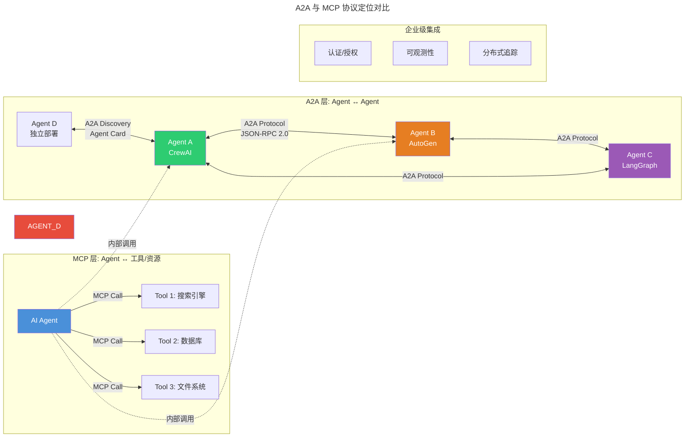
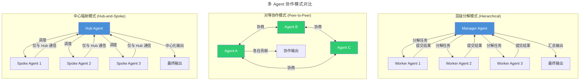

# 多 Agent 协作架构 (Multi-Agent Collaboration Architecture)

## Executive Summary

多 Agent 协作系统正在从学术概念演进为生产级基础设施。2024-2025 年间，随着 Google 发布 A2A (Agent2Agent) 协议[1]、Anthropic 推动 MCP (Model Context Protocol) 标准化[2]，以及 CrewAI[3]、AutoGen[4]、LangGraph[5] 等框架的成熟，多 Agent 架构已进入标准化竞争的快车道。本报告系统梳理多 Agent 协作的三大核心维度——协作模式、通信协议与框架生态，回答三个关键问题：多 Agent 系统的核心挑战、A2A 与 MCP 的定位差异、以及生产级架构的实际设计模式。

---

## 1. 多 Agent 协作模式

### 1.1 任务分解与分配

多 Agent 系统的核心价值在于将复杂任务拆解为可并行或顺序执行的子任务，并分配给具有不同能力的专精 Agent。当前主流的分解模式有三种：

**层级分解 (Hierarchical Decomposition)**：由一个 Manager Agent 接收用户请求，分解为子任务后分配给 Worker Agent，最终汇总结果。这是 CrewAI 和 AutoGen 的默认模式[3][4]。优点是结构清晰、易于追踪；缺点是 Manager 成为瓶颈，存在单点故障风险。

**图结构分解 (DAG-based Decomposition)**：LangGraph 允许开发者将任务流建模为有向无环图 (DAG)，节点代表 Agent 或处理步骤，边代表数据流和依赖关系[5]。这种模式支持并行执行和条件分支，适合需要复杂编排的场景。

**涌现式协作 (Emergent Collaboration)**：不预定义任务流，Agent 通过自然语言协商决定分工。AutoGen 的 ConversableAgent 支持这种模式，Agent 可以自主发起、接受或拒绝任务[4]。灵活性最高，但行为不可预测性也最高。

### 1.2 角色分工机制

CrewAI 的角色分工最为典型——每个 Agent 定义 `role`（角色）、`goal`（目标）、`backstory`（背景故事），通过角色扮演驱动行为差异[3]。这种设计源自斯坦福小镇实验 (Generative Agents)，已被广泛采用[6]。

AutoGen 采用更灵活的配置方式，通过 `system_message` 定义 Agent 行为，并支持 `AgentTool` 将一个 Agent 包装为另一个 Agent 的工具，实现嵌套式角色分工[4]。

### 1.3 共识机制

在需要多 Agent 协作决策的场景（如多专家评审），常见的共识机制包括：

- **投票机制 (Voting)**：多个 Agent 独立产出结果，通过多数投票或加权投票决定最终输出
- **链式验证 (Chain-of-Verification)**：一个 Agent 的输出作为另一个 Agent 的输入进行验证
- **辩论机制 (Debate)**：Agent 轮流提出论点和反驳，直到达成共识或达到最大轮次

---

## 2. Agent 间通信协议

### 2.1 A2A 协议 (Agent2Agent Protocol)

A2A 是 Google 于 2025 年 4 月发布的开源协议，专门解决跨框架、跨厂商 Agent 之间的协作问题[1]。其核心设计理念：

**核心特性**：
- **基于 JSON-RPC 2.0 over HTTP(S)**，复用成熟标准而非发明新协议
- **Agent 发现机制**：通过 "Agent Card"（JSON 文件）声明能力、交互方式和连接信息
- **不透明执行 (Opaque Execution)**：Agent 协作时不需暴露内部状态、内存或工具实现
- **异步优先**：原生支持长运行任务和 Human-in-the-Loop 场景
- **模态无关**：支持文本、文件、结构化数据、甚至嵌入式 UI 组件

**协议架构分层**[7]：
- Layer 1: 数据模型（Task, Message, AgentCard, Part, Artifact）
- Layer 2: 抽象操作（Send Message, Stream Message, Get Task 等）
- Layer 3: 协议绑定（JSON-RPC, gRPC, HTTP/REST）

### 2.2 MCP 协议 (Model Context Protocol)

MCP 是 Anthropic 于 2024 年 11 月发布的协议，定位为 "AI 应用的 USB-C 端口"[2]。其设计目标是标准化 AI 应用与外部系统（数据源、工具、工作流）的连接方式。

**核心特性**：
- **Client-Server 架构**：AI 应用作为 MCP Client，外部系统作为 MCP Server
- **标准化工具发现和调用**：Server 暴露工具列表，Client 发现并调用
- **支持多种传输层**：stdio、HTTP + SSE、Streamable HTTP

### 2.3 A2A vs MCP：定位差异与适用场景

这是业界最核心的区分[1][2][8]：

| 维度 | MCP | A2A |
|------|-----|-----|
| **连接方向** | Agent → 工具/资源 | Agent ↔ Agent |
| **定位** | Agent 与外部系统交互的接口 | Agent 与 Agent 协作的接口 |
| **类比** | USB-C（设备连接外设） | 电话（人与人对话） |
| **交互模式** | 请求-响应为主 | 支持流式、异步推送、长任务 |
| **发现机制** | Server 暴露工具列表 | Agent Card 声明能力 |
| **状态管理** | 无状态 | 支持有状态的长运行任务 |

**互补关系而非竞争**：一个完整的多 Agent 系统可能同时使用两种协议——内部 Agent 通过 MCP 访问工具和数据源，跨组织/跨框架的 Agent 之间通过 A2A 协作[1]。Google 在 A2A 文档中明确指出 "A2A complements MCP"[1]。

---

## 3. 框架对比

### 3.1 CrewAI

CrewAI 是当前最流行的开源多 Agent 编排框架之一，拥有超过 100,000 名认证开发者[3]。

**核心概念**：
- **Flows**：结构化、事件驱动的工作流，负责状态管理和执行控制
- **Crews**：由角色扮演 Agent 组成的团队，协作完成特定任务
- **Crews 嵌入 Flows**：Flows 定义整体结构，Crews 处理需要自主协作的复杂子任务

**优势**：API 简洁易上手、角色扮演驱动的 Agent 协作直观、生产就绪度高
**局限**：对底层通信控制有限、自定义协议扩展能力弱

### 3.2 AutoGen (Microsoft)

AutoGen 是微软研究院推出的多 Agent 框架，2023 年发表论文[4]，2025 年已发展至 v0.4 并整合入微软 Agent Framework。

**核心特性**：
- **分层设计**：Core API（消息传递、事件驱动、分布式运行时）+ AgentChat API（高层快速原型）
- **AgentTool 嵌套**：可将 Agent 包装为另一个 Agent 的工具
- **MCP 集成**：原生支持通过 McpWorkbench 连接 MCP Server[4]
- **AutoGen Studio**：无代码 GUI 用于快速原型设计

**优势**：学术背景扎实、分布式运行时支持、微软生态整合
**局限**：框架复杂度较高、API 在 v0.2→v0.4 间有重大变更

### 3.3 LangGraph

LangGraph 是 LangChain 生态的低层级编排框架，专注 Agent 的状态管理和长期运行工作流[5]。

**核心特性**：
- **StateGraph**：将 Agent 工作流建模为图结构，支持条件分支、循环和并行
- **Durable Execution**：持久化执行，支持故障恢复和长时间运行
- **Human-in-the-Loop**：原生支持在任意节点暂停等待人工干预
- **Comprehensive Memory**：短时工作记忆 + 长期跨会话记忆

**优势**：图结构建模能力强、持久化和恢复机制成熟、LangSmith 可观测性集成
**局限**：学习曲线陡峭、与 LangChain 生态耦合较深

### 3.4 框架对比总览

| 维度 | CrewAI | AutoGen | LangGraph |
|------|--------|---------|-----------|
| **开发者** | CrewAI Inc. | 微软 | LangChain |
| **设计哲学** | 角色扮演 + Flows | 事件驱动 + 分层 | 图结构 + 状态机 |
| **上手难度** | ⭐⭐ 低 | ⭐⭐⭐ 中 | ⭐⭐⭐⭐ 高 |
| **分布式支持** | 有限 | ✅ 原生 | 通过部署平台 |
| **MCP 集成** | 通过工具 | ✅ 原生 McpWorkbench | 通过 LangChain 工具层 |
| **A2A 支持** | 实验性 | 实验性 | 实验性 |
| **适用场景** | 快速原型、中等复杂度 | 研究、复杂编排 | 生产级状态工作流 |
| **GitHub Stars** | 25k+ | 40k+ | 12k+ |

---

## 4. 多 Agent 系统的核心挑战

### 4.1 通信效率

Agent 间通过自然语言（JSON 消息）通信会导致大量 token 消耗。根据 AutoGen 论文[4]，在复杂的多 Agent 协作场景中，token 消耗可比单 Agent 高 5-10 倍。当前的缓解策略包括：

- **结构化通信**：用 JSON Schema 约束消息格式，减少冗余描述
- **上下文压缩**：只传递必要信息而非完整历史
- **分层抽象**：高层用自然语言规划，低层用结构化数据执行

### 4.2 状态同步

在分布式多 Agent 系统中，状态同步是核心难题[9]：

- **共享状态 vs 消息传递**：共享状态（如 Redis）适合频繁读写；消息传递适合松耦合
- **一致性保证**：最终一致性通常足够，但关键操作需要强一致性
- **LangGraph 的解决方案**：通过 StateGraph 定义全局状态 schema，在节点间通过更新函数合并状态[5]

### 4.3 死锁与活锁避免

当多个 Agent 互相等待对方完成时会产生死锁；当 Agent 陷入无意义的反复协商时会产生活锁。当前的最佳实践：

- **超时机制**：为每个任务设置最大执行时间
- **最大轮次限制**：限制 Agent 间协商的最大回合数
- **Monitor Agent**：引入独立的监控 Agent 检测和打破死锁
- **确定性编排**：用 LangGraph 等框架预定义执行路径，避免 Agent 自主协商的不确定性[5]

### 4.4 可观测性与调试

多 Agent 系统的调试复杂度远高于单 Agent。LangSmith 的分布式追踪[5]、AutoGen 的日志系统[4]是当前最成熟的可观测性方案，但仍面临以下挑战：

- 跨 Agent 调用链追踪
- 自然语言消息的语义调试
- 性能瓶颈定位（哪个 Agent 导致延迟）

---

## 5. 生产级架构设计模式

### 5.1 模式一：Orchestrator-Workers（编排者-工作者）

这是最常见的多 Agent 架构模式。一个 Orchestrator Agent 负责任务分解和分配，多个 Worker Agent 并行处理子任务，最终汇总结果。

**适用场景**：内容生成流水线、数据分析管道、代码审查
**代表框架**：CrewAI Flows、LangGraph StateGraph

### 5.2 模式二：Peer-to-Peer（对等协作）

Agent 之间直接通信，通过协商决定任务分工。每个 Agent 既是生产者也是消费者。

**适用场景**：模拟场景、辩论系统、分布式决策
**代表框架**：AutoGen 的 GroupChat

### 5.3 模式三：Hub-and-Spoke（中心辐射）

一个中央 Hub Agent 维护全局状态和上下文，所有 Spoke Agent 只与 Hub 通信，不直接互相对话。

**适用场景**：客服系统、任务管理、需要强一致性的场景
**优势**：通信路径简单、状态管理集中、易于调试

---

## 6. 2024-2026 关键进展

### 6.1 协议标准化

- **2024 年 11 月**：Anthropic 发布 MCP 协议[2]，迅速获得 Claude、ChatGPT、VS Code、Cursor 等主流平台支持
- **2025 年 4 月**：Google 发布 A2A 协议[1]，由 Linux Foundation 托管，支持 Python/Go/JS/Java/.NET SDK
- **2025 年**：A2A 1.0.0 正式发布[7]，定义了完整的三层协议架构
- **趋势**：MCP 定义 "Agent-工具" 层标准，A2A 定义 "Agent-Agent" 层标准，两者互补[8]

### 6.2 框架演进

- **AutoGen v0.4**：引入分层架构、分布式运行时、原生 MCP 支持，并入微软 Agent Framework[4]
- **LangGraph**：成为 Agent 编排的事实标准之一，LangSmith 提供端到端可观测性[5]
- **CrewAI**：推出 Flows 架构，从纯角色扮演演进为 Flows + Crews 的双层设计[3]
- **OpenClaw**：作为一个去中心化的 Agent 操作系统，提出了多 Agent 协作的另一种范式——通过节点配对实现跨设备 Agent 协作[10]

### 6.3 行业应用

- **企业自动化**：Klarna、Replit、Elastic 等公司采用 LangGraph 构建生产级 Agent 系统[5]
- **医疗**：Google 和 IBM 合作的 A2A 教程中展示了跨框架医疗多 Agent 系统[1]
- **软件开发**：AutoGen 在代码生成、调试、审查等场景的广泛应用[4]

---

## 结论

多 Agent 协作架构正在经历从"各自为战"到"标准化互联"的范式转变。三个核心趋势值得关注：

1. **协议分层已成共识**：MCP 负责 Agent-工具层，A2A 负责 Agent-Agent 层，两者互补而非竞争。选择协议时应根据实际场景——内部工具调用优先 MCP，跨系统 Agent 协作优先 A2A。

2. **框架选择取决于复杂度**：快速原型选 CrewAI，复杂编排选 AutoGen，生产级状态工作流选 LangGraph。没有银弹，选择应基于团队技术栈和具体需求。

3. **核心挑战仍在通信层**：token 效率、状态同步和死锁避免是制约多 Agent 系统规模化的关键瓶颈。随着协议标准化和框架成熟，这些问题将逐步缓解，但短期内仍是架构设计的核心考量。

<!-- REFERENCE START -->
## 参考文献

1. Google. A2A (Agent2Agent) Protocol. (2025). https://github.com/a2aproject/A2A
2. Anthropic. Model Context Protocol (MCP). (2024). https://modelcontextprotocol.io/docs/getting-started/intro.md
3. CrewAI. Introduction to CrewAI. (2025). https://docs.crewai.com/en/introduction.md
4. Wu, Q. et al. AutoGen: Enabling Next-Gen LLM Applications via Multi-Agent Conversation. (2023). https://arxiv.org/abs/2308.08155
5. LangChain. LangGraph Overview. (2025). https://docs.langchain.com/oss/python/langgraph/overview
6. Park, J. et al. Generative Agents: Interactive Simulacra of Human Behavior. (2023). https://arxiv.org/abs/2304.03442
7. A2A Protocol. Specification v1.0.0. (2025). https://a2a-protocol.org/latest/specification/
8. Google Cloud. A2A and MCP Complementary Architecture. (2025). https://a2a-protocol.org/latest/topics/what-is-a2a/
9. Microsoft. AutoGen Ecosystem Architecture. (2025). https://github.com/microsoft/autogen
10. OpenClaw. OpenClaw Documentation. (2025). https://docs.openclaw.ai
