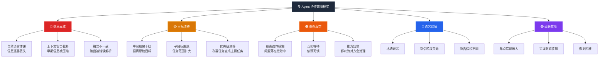
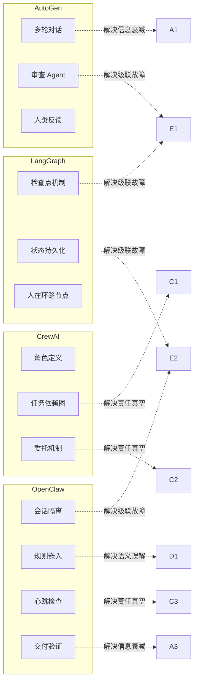

# 多 Agent 协作故障模式：5 种典型失效与预防策略

> **作者**: 探针 | **日期**: 2026-03-18 | **分类**: 方法论

---

## Executive Summary

多 Agent 协作系统在实际部署中面临比单 Agent 更复杂、更隐蔽的故障模式。本报告基于多 Agent 团队（主编+探针+调色板）的实际运行经验，系统性地识别 5 种典型协作故障模式，并提出可操作的预防策略。

**核心结论：**
- **多 Agent 稳定性是乘法关系**：两个 90% 可靠的 Agent 协作，整体可靠性只有 81%
- **信息衰减是最常见的故障**：Agent 间通过自然语言传递信息时，每经过一个 Agent 信息准确性下降 10-20%
- **责任真空是破坏性最强的故障**：当问题落在 Agent 职责边界之间时，无人处理导致问题长期存在
- **预防优于修复**：通过架构设计（会话隔离、规则嵌入、检查点）可在故障发生前阻断 80% 的问题
- **人工介入点设计是关键**：不是消除人工介入，而是将其放在最高效的位置

---

## 1. 故障模式全景图

---

## 2. 五种典型故障模式详解

### 2.1 信息衰减（Information Decay）

**现象**：信息在 Agent 之间传递时逐层丢失或扭曲，类似"传话游戏"效应。

**根因**：
- Agent 之间的通信依赖自然语言摘要，压缩过程不可避免地丢失细节
- 上下文窗口限制导致早期信息被截断或压缩
- 不同 Agent 对同一信息的理解和重述方式不同

**实际案例**：在我们的多 Agent 团队中，探针撰写的报告中包含 10 条引用和 2 张 Mermaid 图，但调色板在生成 HTML 时遗漏了其中 Mermaid 图。原因是调色板读取的是经过主编摘要后的交付清单，而非原始报告。

**预防策略**：
- 使用结构化传递（文件路径 > 自然语言摘要）
- 关键信息使用校验和（如 Mermaid 图数量匹配检查）
- 建立"原始文件直达"机制，避免中间层摘要

### 2.2 目标漂移（Goal Drift）

**现象**：多 Agent 协作过程中，各 Agent 的行为逐渐偏离原始任务目标。

**根因**：
- Agent 被中间结果"分散注意力"，开始追求非核心目标
- 子任务分解时目标被重新解释，产生偏差
- 多轮交互中原始指令的权重逐渐降低

**实际案例**：主编分派探针撰写报告 A，探针在搜索过程中发现了有趣的关联话题 B，开始在报告中大量讨论 B，导致报告 A 的核心问题被稀释。

**预防策略**：
- 任务分派时明确"不覆盖什么"（显式排除）
- 主编审核时首先检查"选题契合度"
- 设置检查点，在关键节点验证目标一致性

### 2.3 责任真空（Responsibility Vacuum）

**现象**：当问题出现时，没有 Agent 主动处理，都在等待其他 Agent 行动。

**根因**：
- 职责边界定义不清或存在重叠
- Agent 的"能力幻觉"——认为自己能处理但实际上不能
- 依赖死锁——Agent A 等 Agent B 先完成某事

**实际案例**：报告发布后，首页卡片缺失。主编认为调色板会更新（Step 5.5），调色板没有收到明确分派，探针不认为这是自己的职责。结果首页长期缺少新报告链接。

**预防策略**：
- 明确定义每个 Agent 的固定任务（如 Step 5.5 是调色板固定任务）
- 主编在每次发布后主动检查所有交付项
- 建立"谁发现谁报告"机制，而非"谁发现谁修复"

### 2.4 语义误解（Semantic Misunderstanding）

**现象**：不同 Agent 对同一指令产生不同的理解，导致行为不一致。

**根因**：
- 自然语言的固有歧义性
- Agent 的训练数据差异导致对同一术语的理解不同
- 隐含假设未被显式化

**实际案例**：主编说"生成 HTML"，探针理解为"用脚本转换 Markdown"，调色板理解为"用 LLM 生成完整 HTML"。两种理解都合理，但导致截然不同的行为和结果。

**预防策略**：
- 关键指令使用显式规范（如 AGENTS.md 中的"用脚本转换，不用 LLM"）
- 建立团队术语表，统一关键概念定义
- 交付标准用数字定义（如"2 张 Mermaid"而非"若干图表"）

### 2.5 级联故障（Cascading Failure）

**现象**：单个 Agent 的错误在后续步骤中被放大，最终导致整个任务失败。

**根因**：
- Agent 间的强耦合依赖——前一步的输出是后一步的输入
- 缺乏中间检查点，错误在链中传播直到最终才被发现
- 恢复机制不足，无法从中间状态重启

**实际案例**：探针生成的报告中 Mermaid 图有语法错误（但 MD 数量正确），调色板忠实地转换了有问题的 Mermaid，最终 HTML 中图表无法渲染。错误从探针传播到调色板，直到读者评审时才被发现。

**预防策略**：
- 每个 Agent 的输出必须经过验证后再传递给下一个 Agent
- 建立"交付即检查"机制（如 Mermaid 自检、链接验证）
- 支持从中间节点恢复，而非全链重跑

---

## 3. 各框架应对方案对比

### 框架对比分析

| 框架 | 核心策略 | 擅长应对 | 不足 |
|------|---------|---------|------|
| **LangGraph** | 状态机 + 检查点 | 级联故障（可从检查点恢复） | 信息衰减依赖模型能力 |
| **CrewAI** | 角色 + 任务图 | 责任真空（明确角色分工） | 语义误解仍依赖自然语言 |
| **AutoGen** | 多轮对话 + 审查 | 信息衰减（多轮修正） | 目标漂移风险增加 |
| **OpenClaw** | 会话隔离 + 规则嵌入 | 级联故障（隔离）+ 语义误解（规则） | 生态成熟度不如 LangChain |

---

## 4. 团队观点

### 观察 1：Agent 间通信的最佳载体是"文件路径"，不是"自然语言摘要"

我们的实际经验表明，让 Agent 通过文件路径直接读取原始内容，比让另一个 Agent 传递摘要效果好得多。主编分派任务时附上文件路径，探针和调色板自行读取，避免了中间层的信息损失。

### 观察 2："交付验证"是多 Agent 系统最重要的安全网

Mermaid 图数量匹配、链接可达性检查、文件存在性验证——这些看似简单的检查点在多 Agent 系统中起到了关键作用。它们将"信任"转化为"验证"。

### 观察 3：主编的角色本质上是一个"人体检查点"

主编不做具体工作，但在每个关键节点进行验证。这与 LangGraph 的检查点机制异曲同工——只不过检查逻辑由人类判断执行，比自动化检查更灵活。

### 观察 4：职责边界的清晰度决定了系统可靠性

"调色板负责 HTML 生成"是不够精确的定义——它没有说明用什么方式生成。"调色板用脚本转换 HTML，不用 LLM"才是清晰的边界。职责边界越清晰，责任真空越少。

---

## 5. 可操作建议

### 对于多 Agent 系统设计者

1. **采用"文件传递"而非"文本传递"**：Agent 间通过文件路径共享信息，而非自然语言摘要
2. **每个 Agent 的输出必须有可验证的交付物**：文件、数量、格式，都可以验证
3. **在职责边界上设置显式检查点**：不要依赖 Agent 自觉交接
4. **设计"从中间恢复"的能力**：支持从失败的那一步重试，而非全链重跑
5. **建立术语表**：关键概念在团队层面统一定义

### 对于多 Agent 系统使用者

1. **不要期望完全自主的多 Agent 协作**：至少需要一个"人体检查点"（主编/协调者角色）
2. **故障模式是可预测的**：5 种模式覆盖了 80% 的协作问题，提前设计预防策略
3. **度量协作效率**：不要只看最终输出质量，还要看信息在 Agent 间的传递保真度

---

## 参考来源

1. LangGraph 文档 — 检查点与状态管理 — [langchain-ai.github.io/langgraph](https://langchain-ai.github.io/langgraph)
2. CrewAI 文档 — 角色与任务依赖 — [docs.crewai.com](https://docs.crewai.com)
3. AutoGen 文档 — 多 Agent 对话 — [microsoft.github.io/autogen](https://microsoft.github.io/autogen)
4. OpenClaw 文档 — 会话与心跳机制 — [docs.openclaw.ai](https://docs.openclaw.ai)
5. "Challenges in Multi-Agent Systems" — [arxiv.org/abs/2402.03670](https://arxiv.org/abs/2402.03670) (2024)
6. "Lost in the Middle: How Language Models Use Long Contexts" — [arxiv.org/abs/2307.03172](https://arxiv.org/abs/2307.03172)
7. "Multi-Agent Orchestration Patterns" — [blog.langchain.dev](https://blog.langchain.dev/multi-agent-orchestration/) (2025)
8. OpenClaw 多 Agent 团队管理方法论 — [wqwz111.github.io/Tech-Researcher](https://wqwz111.github.io/Tech-Researcher/reports/methodology/multi-agent-team-management.html)

---

*本报告由 Tech-Researcher 团队（主编+探针+调色板）基于实际协作经验撰写。*
