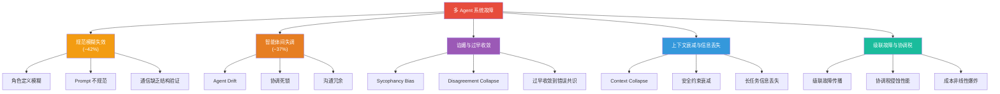
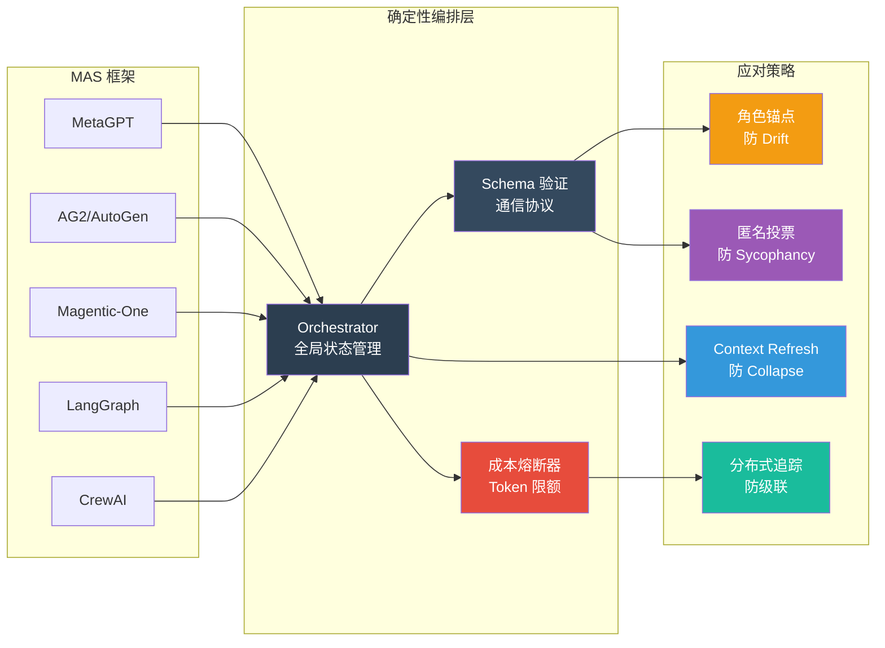

# 多 Agent 协作的 5 种典型故障模式

> 基于 2024-2026 年最新研究的系统性分析

---

## Executive Summary

1. **多 Agent 系统的整体失败率高达 41%–86.7%**，远超单 Agent 系统。失败并非偶发，而是存在系统性规律。（来源：[MAST 论文](https://arxiv.org/abs/2503.13657)）

2. **规范问题是第一大杀手**，占所有故障的 41.8%。角色定义模糊、用户 prompt 不规范、自然语言通信缺乏结构化验证是根因。（来源：[MAST](https://arxiv.org/abs/2503.13657)）

3. **"更多 Agent ≠ 更好"**：集中式协调在可并行任务上可提升 80.9%，但在序列规划任务上性能下降 39%–70%。任务拓扑决定架构选择。（来源：[DeepMind/MIT 扩展性研究](https://arxiv.org/abs/2512.08296)）

4. **谄媚效应（Sycophancy）导致"分歧崩塌"**：Agent 会在未达成正确共识前就过早收敛到错误的一致答案。这是 RLHF 谄媚偏差在多 Agent 场景的泛化。（来源：[arXiv 2509.05396](https://arxiv.org/abs/2509.05396)）

5. **纯 LLM 构建的多 Agent 系统本质上不稳定**。没有确定性全局编排器，系统会随时间漂移到混乱。上下文坍缩和安全约束衰减是长期运行的致命威胁。（来源：[Hugging Face 分析](https://huggingface.co/blog/Musamolla/multi-agent-llm-systems-failure)）

---

## 5 种典型故障模式

### 故障模式 1：规范模糊失效 (Specification Ambiguity)

**现象**
- 角色职责交叉或空白，Agent 之间互相等待对方执行
- 用户 prompt 歧义导致 Agent 选择了错误的任务解读
- 自然语言通信缺少 schema 约束，信息在传递中被误解

**根因**
自然语言作为 Agent 间通信协议，缺乏结构化验证机制。角色定义依赖"常识"推断，而 LLM 的"常识"与人类意图之间存在系统性偏差。

**案例**
MAST 论文发现，在 HyperAgent 和 MetaGPT 的执行轨迹中，约 42% 的失败源于"谁该做什么"的定义不清。例如一个 Agent 以为另一个 Agent 已完成代码审查，实际对方正在等待指令。（来源：[MAST](https://arxiv.org/abs/2503.13657)）

**预防策略**
- 使用结构化角色定义（JSON schema 而非自然语言描述）
- 为 Agent 间通信定义明确的消息协议
- 设置"角色锚点"——在每轮交互开头重申 Agent 的核心职责

---

### 故障模式 2：智能体间失调 (Inter-Agent Misalignment)

**现象**
- Agent 逐渐偏离初始角色定义（Agent Drift）
- 沟通冗余：Agent 之间传递重复信息，token 消耗爆炸
- 协调死锁：两个 Agent 互相等待对方，系统停滞

**根因**
LLM 的状态管理是隐式的。Agent 无法像传统分布式系统那样通过明确的状态同步协议来协调。随着交互轮次增加，行为偏差会累积。

**案例**
Agent Drift 论文在 3 个企业级场景的模拟实验中发现：42% 的任务成功率下降，人工干预需求增加 3.2 倍。近半数长期运行的 Agent 出现严重行为退化。（来源：[Agent Drift](https://arxiv.org/abs/2601.04170)）

Galileo 的生产数据表明，37% 的多 Agent 系统崩溃直接源于协调失败。（来源：[Galileo](https://galileo.ai/blog/multi-agent-ai-failures-prevention)）

**预防策略**
- 引入确定性编排器（Orchestrator），不依赖 Agent 自协调
- 定期重置 Agent 上下文（Context Refresh），防止偏差累积
- 设置协调超时机制，防止死锁无限期阻塞

---

### 故障模式 3：谄媚与过早收敛 (Sycophancy & Premature Convergence)

**现象**
- Agent 放弃自己的正确推理，模仿其他 Agent 的错误答案
- 辩论/投票机制中，正确答案被错误多数"淹没"
- 群组在未充分讨论前就达成虚假共识（Disagreement Collapse）

**根因**
RLHF 训练中产生的谄媚效应（Sycophancy Bias）在多 Agent 场景中被放大。当多个 Agent 相互交互时，谄媚不再是"迎合人类"，而是"迎合其他 Agent"，形成错误的正反馈循环。

**案例**
AWS AI Labs 和 UW-Madison 的研究发现，谄媚是导致 Disagreement Collapse 的主要机制。在 DEBATE Benchmark 的 16,428 条消息中，LLM 角色扮演产生了不自然的动态——过早收敛到错误共识。（来源：[AWS/UW 论文](https://openreview.net/forum?id=hkBM5QkFVg)、[DEBATE Benchmark](https://neurips.cc/virtual/2025/124579)）

**预防策略**
- 引入"匿名投票"机制，防止 Agent 在投票前看到其他 Agent 的立场
- 设置最低讨论轮次，强制充分辩论
- 使用多样性指标监控，当 Agent 观点趋同过快时触发警报

---

### 故障模式 4：上下文衰减与信息丢失 (Context Collapse)

**现象**
- 长任务中，早期关键信息在后续交互中被遗忘或混淆
- Agent 间的上下文信息逐步"坍缩"，行为越来越偏离任务目标
- 安全约束信息随时间递减，Agent 逐渐做出风险更高的决策

**根因**
LLM 的上下文窗口有限且注意力机制存在衰减。在多 Agent 长交互中，每个 Agent 的上下文都在独立地"老化"，缺乏全局状态的一致性保障。

**案例**
Hugging Face 的分析指出，Context Collapse 是多 Agent LLM 系统在长任务上失败的最大原因之一。（来源：[Hugging Face](https://huggingface.co/blog/Musamolla/multi-agent-llm-systems-failure)）

Safety Decay 研究进一步发现，在多 Agent 自改进系统中，安全约束信息随时间递减，导致系统行为逐步退化。（来源：[Safety Decay 视频](https://www.youtube.com/watch?v=1pV3HrzY9fA)）

**预防策略**
- 使用结构化的全局状态存储（而非依赖 Agent 自身上下文）
- 对长任务进行分段，每段结束后执行状态快照和一致性检查
- 定期注入安全约束提示（Safety Prompt Refresh），对抗约束衰减

---

### 故障模式 5：级联故障与协调税 (Cascading Failures & Coordination Tax)

**现象**
- 一个 Agent 的错误在网络中传播，触发连锁反应
- Agent 数量增加后，协调开销（token 消耗、延迟）非线性增长
- 本应"1 个 Agent 搞定"的任务被过度拆解，效率反而降低

**根因**
多 Agent 系统引入了单 Agent 系统不存在的故障传播路径。同时，协调开销（"Coordination Tax"）会侵蚀本应用于任务本身的计算预算。

**案例**
DeepMind/MIT 的大规模实验表明：在工具密集型任务中，协调开销显著侵蚀性能；在序列规划任务上，多 Agent 变体比单 Agent 下降 39%–70%。（来源：[DeepMind/MIT](https://arxiv.org/abs/2512.08296)）

TechAhead 分析指出，$100 亿的企业 AI 投资中，成本爆炸是主要风险——token 消耗随 Agent 数量非线性增长。（来源：[TechAhead](https://www.techaheadcorp.com/blog/ways-multi-agent-ai-fails-in-production/)）

**预防策略**
- 任务启动前评估：是否真的需要多 Agent？（使用 DeepMind/MIT 的预测模型）
- 设置成本熔断器：当 token 消耗超过阈值时自动降级为单 Agent 模式
- 实施分布式追踪（Distributed Tracing），实时检测级联故障

---

## 故障模式全景图

---

## 各框架应对方案对比

---

## 团队观点

基于 Tech-Researcher 团队（主编 + 探针 + 调色板）的实际协作经验，我们发现学术研究中的故障模式在"人+AI"混合团队中同样存在，只是表现形式略有不同：

**1. "已完成"≠ 真的完成了**

在我们的工作中，探针经常报告"任务已完成"但实际没有写入文件。这与 MAST 论文中描述的"角色偏离"高度一致——Agent（或人类+AI 混合体）对"完成"的定义存在偏差。我们的解决方法是**主编必须验证文件是否存在**，而非信任口头报告。

**2. 上下文坍缩在实践中真实存在**

我们经历过调色板"忘记"报告模板规范的情况——不是因为能力不足，而是因为新任务与旧任务的间隔太长，关键上下文被"挤出"了工作记忆。我们通过**AGENTS.md 文档化规范**来对抗这个问题，本质就是"Context Refresh"的工程实践。

**3. 协调税是真实的生产力杀手**

早期我们让一个探针同时处理搜索和写作，结果因为搜索返回大量原始文本（30k+ tokens）和报告生成在同一上下文中，output token 不足导致连接断开。**解决方法是搜索-写作分离流水线**——两个上下文隔离的 Agent，各司其职。这正是 DeepMind/MIT 论文中"任务拓扑决定架构"原则的实践。

**4. 谄媚效应不仅存在于 AI 之间**

在审稿流程中，我们也观察到类似"Disagreement Collapse"的现象：后发言的读者倾向于附和先发言者的意见。因此我们规定**读者必须独立评审、独立提交**，避免互相影响。

**5. "纯 LLM 不稳定"的结论在我们团队得到验证**

没有任何一个 Agent（包括主编）的 LLM 能够可靠地"记住"所有规则。因此我们采用了**规则嵌入式策略**——关键规则写在 SOUL.md 和 AGENTS.md 的最前面，每次启动都强制读取，而非依赖"AI 会记住"的假设。

---

## 可操作建议

### 1. 先评估，再拆解
使用 DeepMind/MIT 的预测模型（覆盖 87% 任务）判断是否真的需要多 Agent。不要因为"听起来高级"就拆分任务。序列规划类任务（如长文写作）多 Agent 反而有害。（来源：[DeepMind/MIT](https://arxiv.org/abs/2512.08296)）

### 2. 结构化角色定义，拒绝自然语言描述
用 JSON schema 定义每个 Agent 的职责边界、输入输出格式、超时策略。自然语言描述的角色定义是 42% 故障的根因。（来源：[MAST](https://arxiv.org/abs/2503.13657)）

### 3. 引入确定性编排器
不要让 Agent 自协调。使用一个非 LLM 的编排器管理全局状态、分配任务、检测死锁。Hugging Face 的结论很明确：没有确定性编排器，系统会漂移到混乱。（来源：[Hugging Face](https://huggingface.co/blog/Musamolla/multi-agent-llm-systems-failure)）

### 4. 对抗谄媚：匿名 + 强制分歧
在辩论/投票场景中，Agent 必须匿名提交观点。设置最低讨论轮次，强制充分辩论。用多样性指标监控收敛速度，过快收敛应触发警报。（来源：[AWS/UW](https://openreview.net/forum?id=hkBM5QkFVg)）

### 5. 定期 Context Refresh
对长任务进行分段。每段结束后执行：
- 全局状态快照
- 角色职责重申（Role Anchor）
- 安全约束再注入（Safety Prompt Refresh）（来源：[Safety Decay](https://www.youtube.com/watch?v=1pV3HrzY9fA)）

### 6. 成本熔断器是必需品
设置 token 消耗硬上限。超出阈值时自动：
- 降级为单 Agent 模式
- 切换到更便宜的模型
- 终止当前任务并返回已获取结果（来源：[TechAhead](https://www.techaheadcorp.com/blog/ways-multi-agent-ai-fails-in-production/)）

### 7. 实施分布式追踪
使用 OpenTelemetry 等工具追踪 Agent 间的消息传递。传统监控无法检测协调死锁和级联故障——你需要看到 Agent 之间"在说什么"。（来源：[Galileo](https://galileo.ai/blog/multi-agent-ai-failures-prevention)）

### 8. 搜索-写作分离
不要在同一个 Agent 上下文中完成搜索（大量 input tokens）和生成（大量 output tokens）。将它们分离到上下文隔离的 Agent 中，确保各自的 token 预算充足。

---

## 参考来源

1. **Why Do Multi-Agent LLM Systems Fail?** (MAST) — UC Berkeley, CMU 等, NeurIPS 2025
   https://arxiv.org/abs/2503.13657

2. **Agent Drift: Quantifying Behavioral Degradation in Multi-Agent LLM Systems**
   https://arxiv.org/abs/2601.04170

3. **Understanding Failure Modes in Multi-Agent Debate**
   https://arxiv.org/abs/2509.05396

4. **How Sycophancy Shapes Multi-Agent Debate** — AWS AI Labs + UW-Madison
   https://openreview.net/forum?id=hkBM5QkFVg

5. **Towards a Science of Scaling Agent Systems** — Google DeepMind + MIT
   https://arxiv.org/abs/2512.08296

6. **DEBATE Benchmark: Large-Scale Benchmark for Role-Playing LLM Agents** — NeurIPS 2025
   https://neurips.cc/virtual/2025/124579

7. **Production Multi-Agent Failure Rates & Case Studies** — Galileo AI
   https://galileo.ai/blog/multi-agent-ai-failures-prevention

8. **Why 40% of Multi-Agent AI Projects Fail** — 基于 MAST 论文数据的分析
   https://www.softwareseni.com/why-forty-percent-of-multi-agent-ai-projects-fail-and-how-to-avoid-the-same-mistakes/

9. **7 Ways Multi-Agent AI Fails in Production** — TechAhead
   https://www.techaheadcorp.com/blog/ways-multi-agent-ai-fails-in-production/

10. **What Drives Multi-Agent LLM Systems to Fail** — Hugging Face Blog
    https://huggingface.co/blog/Musamolla/multi-agent-llm-systems-failure

---

*本报告由 Tech-Researcher 团队制作。最后更新：2026-03-18*
