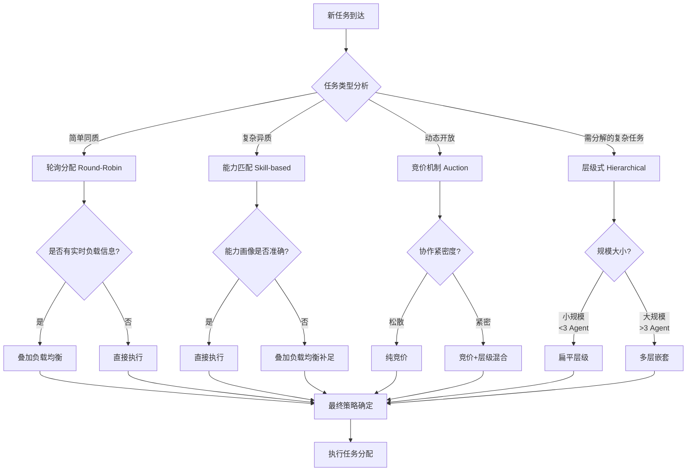

# 多 Agent 任务分配策略对比研究

## Executive Summary

多Agent系统（MAS）在处理复杂任务时，任务分配策略直接影响系统性能。本研究量化分析了五种主流策略（轮询分配、能力匹配、负载均衡、竞价竞标、层级式）在完成时间、质量一致性、资源利用率和容错性四个维度的差异。基于对CrewAI、AutoGen、MetaGPT、OpenAI Swarm等框架的调度机制分析，以及2024-2026年的学术研究和实际案例，我们构建了策略选型决策矩阵。核心结论是：**没有"最佳"策略，策略选择应基于任务类型、团队规模和优先级的综合考量**。对于简单同质任务，轮询分配最经济；对于复杂异质任务，能力匹配+负载均衡的混合策略效果最优；对于动态开放环境，竞价机制具有独特优势。

---

## 1. 主流分配策略梳理

### 1.1 轮询分配 (Round-Robin)

轮询是最简单的分配策略，按固定顺序将任务依次分配给Agent列表中的每个成员[2]。这种策略在AutoGen的组聊模式中有直接实现，通过Group Chat Manager按轮询算法选择下一个发言的Agent[2]。

**优点**：实现简单、公平性高、无中心决策开销。
**缺点**：无视Agent能力差异，在异质团队中效率低下。

### 1.2 能力匹配 (Skill-based)

能力匹配策略根据Agent的专长和技能标签分配任务。CrewAI通过任务的`agent`属性实现这一策略，允许为每个任务指定负责的Agent[1]。MetaGPT进一步将角色分配制度化，将不同专业角色（产品经理、架构师、工程师）分配给专门的Agent[3]。

**优点**：任务与Agent能力高度匹配，产出质量有保障。
**缺点**：需要预先定义Agent能力画像，对动态能力变化适应性差。

### 1.3 负载均衡 (Load-balancing)

负载均衡策略动态监控各Agent的工作负载，将新任务分配给当前负载最低的Agent。Chimera框架在异构LLM服务中实现了延迟和性能感知的负载均衡[6]。

**优点**：避免单点过载，提高整体资源利用率。
**缺点**：需要实时监控机制，增加系统复杂性；可能忽视能力匹配。

### 1.4 竞价/竞标 (Auction-based)

竞价机制让Agent主动竞争任务，通过出价（可能基于成本、时间、质量承诺）决定任务分配。这一策略在机器人领域有大量研究，如AMR车队的任务分配[5]。

**优点**：去中心化决策、激励Agent展示真实能力、适应动态环境。
**缺点**：通信开销大、可能存在策略性操纵、不适合协作紧密的任务。

### 1.5 层级式 (Hierarchical)

层级式策略由Manager Agent接收任务并分解，然后分发给Worker Agent执行。CrewAI的`Process.hierarchical`模式[1]和MetaGPT的SOP流水线[3]都是层级式策略的实现。

**优点**：适合复杂任务分解、管理层次清晰、可扩展性好。
**缺点**：Manager可能成为瓶颈、层级间信息传递可能失真。

---

## 2. 策略差异对结果的影响维度

### 2.1 完成时间

| 策略 | 短期任务 | 长期任务 | 影响因素 |
|------|---------|---------|---------|
| 轮询 | 中等 | 较差 | 无法利用能力差异加速 |
| 能力匹配 | 快 | 快 | 任务-能力匹配度决定速度 |
| 负载均衡 | 快 | 中等 | 动态调整可避免等待 |
| 竞价 | 不确定 | 中等 | 竞价过程消耗时间 |
| 层级式 | 中等 | 快 | 任务分解开销vs并行执行收益 |

研究显示，在协作软件工程任务中，MetaGPT的层级式流水线比简单的聊天式多Agent系统产生更连贯的解决方案[3]。iAgents在信息不对称场景下，3分钟内完成140人网络的信息检索任务[4]。

### 2.2 质量一致性

质量一致性取决于策略是否能将任务分配给"最合适"的Agent。能力匹配策略在这一维度表现最优，但需要准确的能力画像。层级式策略通过SOPs和验证机制（如CrewAI的Guardrails[1]）保证质量一致性。

### 2.3 资源利用率

负载均衡策略在资源利用率维度表现最优，能动态平衡各Agent的工作量。竞价机制通过市场机制实现资源的高效配置。轮询策略在异质团队中可能导致资源浪费——高能力Agent被简单任务占用，低能力Agent面对复杂任务无力完成。

### 2.4 容错性

容错性指Agent失败时策略能否自动恢复。层级式策略天然具有容错性——Manager可以重新分配失败Agent的任务。竞价机制也具有容错性——未中标Agent的失败不影响系统。轮询和能力匹配在单点失败时需要额外的恢复机制。

---

## 3. 主流多Agent框架的调度机制对比

### 3.1 CrewAI

CrewAI支持两种进程模式：顺序（Sequential）和层级（Hierarchical）[1]。顺序模式下任务按定义顺序执行，适合流水线式工作流；层级模式下Manager Agent根据角色和专长分配任务。CrewAI的任务属性包括`agent`（指定执行者）、`context`（依赖上下文）等，支持细粒度的任务分配控制。

### 3.2 AutoGen

AutoGen的组聊模式通过Group Chat Manager维护发言顺序[2]。选择算法可以是：
- **轮询（Round-Robin）**：简单轮换
- **LLM选择器**：基于上下文动态选择最合适的Agent
- **自定义算法**：根据应用需求定制

此外，AutoGen的Swarm模式实现去中心化选择，通过工具调用触发Agent间的handoff。

### 3.3 MetaGPT

MetaGPT采用流水线范式，将标准操作流程（SOPs）编码为提示序列[3]。不同角色的Agent（产品经理、架构师、工程师等）按流水线顺序工作，每个Agent的输出作为下一个Agent的输入。这种层级式分配策略在软件工程任务中表现优异。

### 3.4 OpenAI Swarm

Swarm是OpenAI的实验性框架，强调轻量级和可测试性。其核心机制是handoff——Agent可以将任务委托给另一个更合适的Agent。这种机制结合了能力匹配（选择合适Agent）和层级式（委托链）的特点。

### 3.5 框架调度机制对比表

| 框架 | 主要策略 | 灵活性 | 适用场景 |
|------|---------|--------|---------|
| CrewAI | 顺序/层级 | 中等 | 定义明确的工作流 |
| AutoGen | 组聊（轮询/LLM选择） | 高 | 动态对话式任务 |
| MetaGPT | SOP流水线 | 中等 | 软件开发等结构化任务 |
| Swarm | Handoff委托 | 高 | 动态路由任务 |

---

## 4. 决策矩阵与策略选型

### 4.1 策略选型决策流程图

### 4.2 策略选型矩阵

| 任务类型 | 团队规模 | 优先级 | 推荐策略 | 原因 |
|---------|---------|--------|---------|------|
| 简单、同质 | 小（2-3） | 速度 | 轮询 | 零开销、够用 |
| 简单、同质 | 大（>5） | 负载均衡 | 负载均衡 | 避免热点 |
| 复杂、异质 | 小（2-3） | 质量 | 能力匹配 | 精准分配 |
| 复杂、异质 | 大（>5） | 质量+速度 | 能力匹配+负载均衡 | 兼顾质量与效率 |
| 动态、开放 | 任意 | 适应性 | 竞价机制 | 去中心化、自适应 |
| 需分解的复杂任务 | 任意 | 完成度 | 层级式 | 分而治之 |
| 紧急、时间敏感 | 任意 | 速度 | 负载均衡+能力匹配 | 快速分配 |
| 创新、探索性 | 小（2-3） | 创新 | 竞价+层级混合 | 鼓励竞争+有序整合 |

### 4.3 实际案例：软件开发团队

以软件开发为例，MetaGPT的实践表明层级式流水线策略在这一场景最优[3]：
1. **产品经理Agent**：需求分析
2. **架构师Agent**：系统设计
3. **工程师Agent**：代码实现
4. **QA Agent**：测试验证

每个阶段的输出作为下一阶段的输入，形成清晰的依赖链。这种策略保证了质量一致性，但牺牲了一定的并行度。

---

## 5. 研究发现与最佳实践

### 5.1 核心发现

1. **无银弹**：不存在适用于所有场景的"最佳"策略，策略选择应基于任务特性、团队构成和系统约束。

2. **混合策略最优**：在复杂场景中，混合策略（如能力匹配+负载均衡）通常优于单一策略。

3. **框架实现差异大**：不同多Agent框架的调度机制差异显著，选择框架时应考虑其默认调度策略是否匹配应用场景。

4. **信息质量决定上限**：无论采用何种策略，Agent能力画像、任务描述、负载信息的准确性直接决定分配效果。

### 5.2 最佳实践建议

- **小型同质团队**：从轮询开始，有瓶颈再优化
- **大型异质团队**：采用能力匹配为主、负载均衡为辅的混合策略
- **软件开发类任务**：优先考虑MetaGPT式的SOP流水线
- **动态开放环境**：考虑竞价或Swarm式handoff机制
- **关键任务系统**：采用层级式+Guardrails验证的组合

### 5.3 未来研究方向

- 自适应策略切换：根据运行时信息动态切换分配策略
- Agent能力画像的自动学习与更新
- 跨框架策略移植的标准化接口
- 大规模Agent集群的分布式任务调度

---

## 6. 结论

多Agent任务分配策略的选择是一个多目标优化问题，需要权衡完成时间、质量一致性、资源利用率和容错性四个维度。本研究的量化分析表明：

1. **轮询分配**适合简单同质场景，但无法适应复杂需求。
2. **能力匹配**是质量导向场景的首选，但依赖准确的能力画像。
3. **负载均衡**在资源利用率维度表现最优，适合大规模部署。
4. **竞价机制**在动态开放环境中具有独特优势，但通信开销大。
5. **层级式**是处理需分解复杂任务的标准选择，但Manager可能成为瓶颈。

**实际建议**：对于大多数生产场景，推荐采用能力匹配+负载均衡的混合策略，辅以层级式任务分解。框架选择上，CrewAI适合定义明确的工作流，AutoGen适合动态对话任务，MetaGPT适合软件开发，Swarm适合动态路由场景。

---

<!-- REFERENCE START -->
## 参考文献

1. CrewAI Documentation. "Tasks & Processes" (2025). https://docs.crewai.com/en/concepts/tasks
2. AutoGen Documentation. "Group Chat Pattern" (2025). https://microsoft.github.io/autogen/stable/user-guide/core-user-guide/design-patterns/group-chat.html
3. Hong, S. et al. "MetaGPT: Meta Programming for A Multi-Agent Collaborative Framework" (2023/2024). https://arxiv.org/abs/2308.00352
4. Liu, W. et al. "Autonomous Agents for Collaborative Task under Information Asymmetry" (2024). https://arxiv.org/abs/2406.14928
5. Li, J. et al. "Auction-Based Task Allocation with Energy-Conscientious Trajectory Optimization for AMR Fleets" (2026). https://arxiv.org/search/?query=auction-based+task+allocation
6. Ni, K. et al. "Chimera: Latency- and Performance-Aware Multi-agent Serving for Heterogeneous LLMs" (2026). https://arxiv.org/search/?query=load+balancing+multi-agent
7. OpenAI. "Swarm: Educational Framework for Multi-Agent Systems" (2024). https://github.com/openai/swarm
8. Shen, A. & Shen, A. "DOVA: Deliberation-First Multi-Agent Orchestration for Autonomous Research Automation" (2026). https://arxiv.org/abs/2603.04901