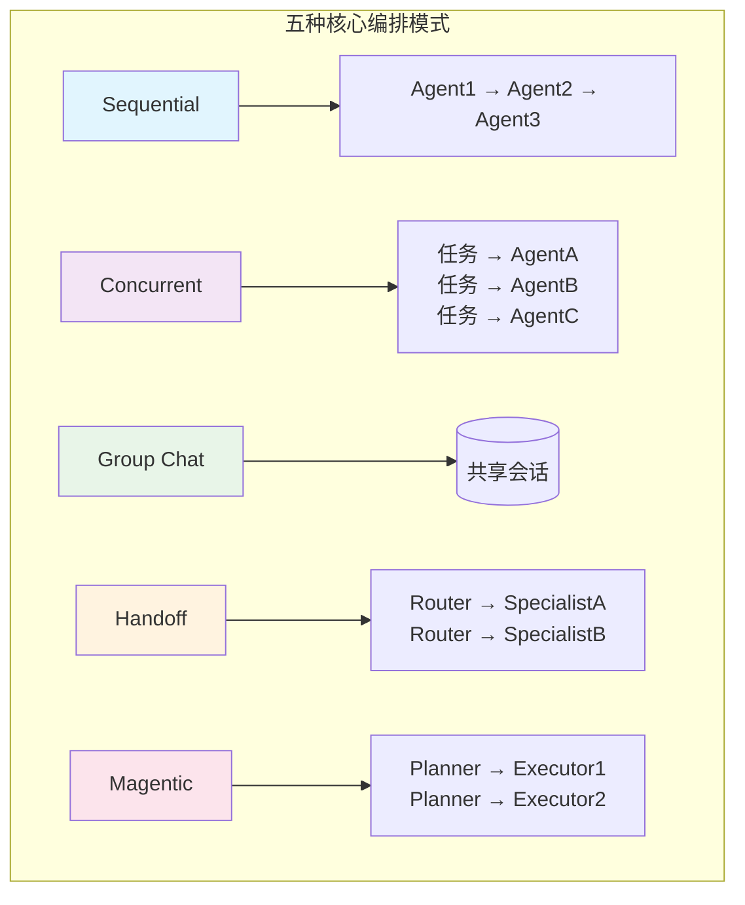
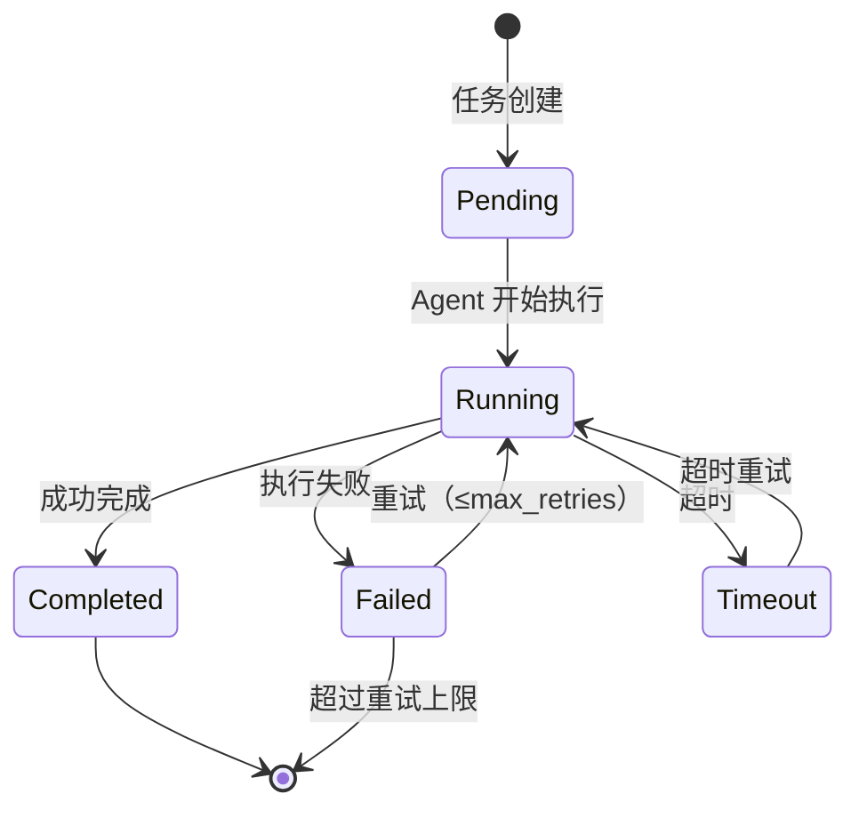
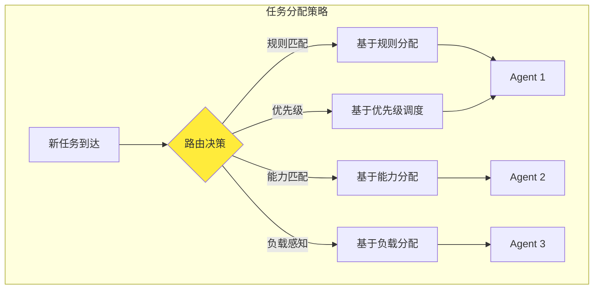

# 多 Subagent 协作的任务管理策略与实现方式

## Executive Summary

随着 LLM 驱动的 AI Agent 从单体走向协作，多 Subagent 系统的任务编排已成为架构设计的核心挑战。本报告系统梳理了 2024-2026 年间主流的多 Agent 任务编排模式、状态管理机制、分配策略、结果聚合方法和错误隔离方案，并对比 OpenAI Swarm、CrewAI、LangGraph、AutoGen 和 Google ADK 等框架的实现差异。

核心发现：
- **编排模式已标准化**：Microsoft Azure 架构中心定义了 Sequential、Concurrent、Group Chat、Handoff 和 Magentic 五种核心模式，Google ADK 进一步扩展至 8 种设计模式[1][4]。
- **协调成本指数增长**：4 个 Agent 产生 6 个失败点，10 个 Agent 产生 45 个——这决定了多 Agent 系统的适用边界[10]。
- **三强格局形成**：LangGraph（生产级复杂度）、CrewAI（快速角色开发）、Microsoft Agent Framework（企业 Azure）成为 2025-2026 年的主流选择[2][6][15]。
- **可靠性来自编排层**：单个 Agent 的推理能力不如编排层的规划、执行、验证机制重要[3]。
- **企业级 ROI 关注升温**：McKinsey 和行业报告指出多 Agent 编排的实施成本与平台选择是企业关键决策[5]。

---

## 1. 多 Agent 任务编排的主流模式

### 1.1 Azure 五大核心编排模式

Microsoft Azure 架构中心在 2026 年 2 月更新的指南中定义了五种经过验证的编排模式[1]：

| 模式 | 拓扑结构 | 适用场景 | 关键特征 |
|------|---------|---------|---------|
| **Sequential（顺序流水线）** | 线性链 | 数据转换、多步骤处理 | Agent 按预定义顺序执行，前一个输出作为下一个输入 |
| **Concurrent（并发）** | 扇出/扇入 | 可并行化任务（如多角度分析） | 多个 Agent 同时处理同一任务的不同方面 |
| **Group Chat（群聊）** | 共享会话 | 多方讨论、决策验证 | Agent 在共享对话中协作，类似人类团队会议 |
| **Handoff（交接）** | 动态委派 | 客服路由、专业领域切换 | 根据上下文动态将任务交接给最适合的 Agent |
| **Magentic（磁性）** | 计划者-执行者 | 复杂工作流 | 中心 Agent 制定计划，其他 Agent 执行外部系统操作 |



### 1.2 Google ADK 的八种设计模式

Google Agent Development Kit (ADK) 在 2026 年的开发者指南中进一步扩展了设计模式[4]：

1. **Sequential Pipeline** — 线性链式处理
2. **Coordinator-Dispatcher** — 中心调度器分发任务
3. **Hierarchical Task Decomposition** — 层次化任务分解
4. **Generator-Critic** — 生成者-评审者循环
5. **Iterative Refinement** — 迭代优化
6. **Human-in-the-Loop** — 人工介入
7. **Parallel Branches** — 并行分支
8. **Composite Patterns** — 复合模式（以上模式的组合）

### 1.3 三种拓扑结构

Augment Code 的企业级研究将多 Agent 架构归纳为三种拓扑[13]：

| 拓扑 | 状态所有权 | 故障域 | 适用规模 |
|------|-----------|--------|---------|
| **Hub-Spoke（星型）** | 集中在 Hub | Hub 是单点故障 | 中小规模（<10 Agent） |
| **Mesh（P2P）** | 分散在各节点 | 故障可隔离 | 小规模、高耦合任务 |
| **Hierarchical（树型）** | 分层所有 | 子树可隔离 | 大规模（10+ Agent） |

---

## 2. 任务状态跟踪机制

### 2.1 标准状态模型

多 Agent 系统的任务状态遵循经典的有限状态机模型：



### 2.2 各框架的状态实现

**CrewAI Flow State** [7]
- 提供 `self.state` 对象，支持字典式和属性式访问
- 内置自动状态 ID，支持持久化到外部存储
- 与 Crew 执行集成，任务输出自动写入状态
- 支持状态可视化和调试日志

```python
# CrewAI Flow State 示例
class ResearchFlow(Flow):
    @start()
    def research(self):
        self.state["topic"] = "Multi-Agent Systems"
        self.state.progress = 0.0
    
    @listen(research)
    def analyze(self):
        self.state.progress = 50.0
        # 状态在步骤间自动传递
```

**LangGraph** — 通过 `StateGraph` 定义状态模式，每个节点可读写状态，边定义状态转换条件。

**AutoGen** — 使用 `GroupChatManager` 维护对话历史作为隐式状态，Agent 间通过消息传递共享上下文。

**OpenAI Swarm** — **无状态设计**[8]，Agent 之间通过 `context_variables` 传递参数，但不保留交互历史。这是其设计上的有意取舍——简化实现但限制了复杂决策能力。

### 2.3 超时处理策略

Prem AI 的研究提出了多层超时处理框架[12]：

| 层级 | 超时类型 | 处理策略 |
|------|---------|---------|
| Agent 级 | 单次推理超时 | 重试 + 降级到更快模型 |
| Task 级 | 任务完成超时 | 中断 + 标记为失败 + 触发备用路径 |
| Workflow 级 | 整体流程超时 | 紧急收尾 + 部分结果返回 |
| System 级 | 系统响应超时 | 熔断 + 人工介入 |

---

## 3. 任务分配策略

### 3.1 负载均衡

**静态分配**：预定义 Agent 角色和任务映射（CrewAI 的 Process.sequential/hierarchical）

**动态分配**：
- **Supervisor 模式**：中央调度器根据 Agent 能力和当前负载分配任务（Kore.ai 企业 SDK 的实现）[9]
- **Round Robin**：AutoGen 的 `RoundRobinGroupChat` 模式按轮次分配[2]
- **基于能力的路由**：Handoff 模式中 Router 根据任务类型选择最合适的 Specialist



### 3.2 优先级调度

企业级系统通常实现多级优先级队列[12]：
- **P0（紧急）**：实时任务，直接分配给最可靠的 Agent
- **P1（高）**：业务关键，排队但允许抢占低优先级任务
- **P2（普通）**：批量处理，FIFO 队列
- **P3（低）**：后台任务，在系统空闲时处理

### 3.3 失败重试策略

指数回退（Exponential Backoff）是各框架的共识[9][10][12]：

| 重试次数 | 等待时间 | 调整策略 |
|---------|---------|---------|
| 第 1 次 | 0s | 正常重试 |
| 第 2 次 | 1s | 降级到更简单的 prompt |
| 第 3 次 | 4s | 切换到更可靠的模型 |
| 第 4 次 | 16s | 分配给备用 Agent |
| 超过上限 | — | 标记失败 + 人工介入 |

---

## 4. 结果聚合

### 4.1 聚合模式

| 模式 | 机制 | 适用场景 |
|------|------|---------|
| **收集-合并** | 等所有 Agent 完成后合并输出 | 并行分析、多角度研究 |
| **投票-裁决** | 多 Agent 独立产出，取多数或加权 | 事实核查、决策验证 |
| **逐步精化** | Agent A 产出 → Agent B 改进 → Agent C 终审 | 内容生成、代码审查 |
| **流式聚合** | 实时收集各 Agent 的部分结果 | 长时任务、实时仪表盘 |

### 4.2 CrewAI 的状态聚合实践

CrewAI Flows 支持通过状态对象实现结果聚合[7]：

```python
@listen(gather_data)
def synthesize(self):
    # 从状态中读取多个 Agent 的结果
    results = self.state.get("agent_results", [])
    summary = "\n".join(results)
    self.state["final_summary"] = summary
```

### 4.3 LangGraph 的条件聚合

LangGraph 通过条件边（Conditional Edges）实现灵活的结果路由——根据 Agent 输出决定下一步是聚合、重试还是继续执行。

---

## 5. 错误隔离

### 5.1 错误类型与影响范围

Galileo AI 的研究指出[10]，多 Agent 系统的失败模式主要有：

| 失败模式 | 原因 | 影响范围 |
|---------|------|---------|
| **上下文丢失** | Agent 间信息传递失败 | 单个 Agent → 下游依赖 |
| **无限循环** | Agent 间互相依赖形成死锁 | 相关 Agent 子集 |
| **协调失败** | Router/Supervisor 错误分派 | 整个系统 |
| **级联错误** | 上游错误传播到下游 | 执行链的所有 Agent |
| **上下文窗口溢出** | 消息累积超出模型限制 | 单个 Agent |

### 5.2 隔离策略

Toucan Toco 的实践总结了层级化错误处理策略[9]：

```mermaid
flowchart TD
    subgraph "错误隔离与处理"
        E[Agent 执行失败]
        E --> Classify{错误分类}
        
        Classify -->|临时错误| Retry[指数回退重试]
        Classify -->|永久错误| Fallback[降级处理]
        Classify -->|超时| Timeout[超时熔断]
        Classify →|致命错误| Emergency[紧急停止]
        
        Retry -->|成功| OK[返回结果]
        Retry -->|超过重试上限| Fallback
        
        Fallback --> Partial[部分结果返回]
        Timeout --> Partial
        Emergency --> Notify[通知人工介入]
        
        Partial --> Aggregate[聚合层处理]
        OK --> Aggregate
    end

    style E fill:#ffcdd2
    style OK fill:#c8e6c9
    style Emergency fill:#ff5722,color:white
```

**结构化错误返回**（Toucan 方案）[9]：
```json
{
  "error_type": "temporary",
  "category": "rate_limit",
  "metadata": {
    "retry_after": 5,
    "agent_id": "researcher-01"
  }
}
```

**故障域隔离**（Augment Code 方案）[13]：
- Hub-Spoke：Hub 故障时 Spoke 降级为独立处理
- Hierarchical：子树故障不影响其他子树
- 每个 Agent 设置独立的超时和重试策略

### 5.3 可观测性是安全网

Zartis 的研究强调[11]，可靠的错误隔离需要完整的可观测性层：

- **跟踪 Agent 推理路径**：不是只看输入输出，而是追踪每一步决策
- **指标分类**：性能（延迟/完成率）、质量（交接成功率/工具选择准确率）、成本（每 Agent token 消耗）、可靠性（错误聚类/漂移检测）
- **防护栏**：人工介入点不是"额外功能"，而是核心基础设施

---

## 6. 框架对比

### 6.1 框架特性对比

| 特性 | OpenAI Swarm | CrewAI | LangGraph | AutoGen | Google ADK |
|------|-------------|--------|-----------|---------|------------|
| **定位** | 教学/实验 | 快速开发 | 生产级 | 企业协作 | Google Cloud |
| **学习曲线** | 低 | 中 | 高 | 中 | 中高 |
| **状态管理** | 无状态 | Flow State | StateGraph | 对话历史 | 内置 |
| **编排模式** | Handoff | Sequential/Hierarchical | 任意 DAG | Round Robin/Group Chat | 8 种模式 |
| **错误处理** | 基础 | 内置重试 | 自定义节点 | 管理器级别 | 平台级别 |
| **可观测性** | 无 | Tracing（AMP） | LangSmith | 内置日志 | Cloud Monitoring |
| **生产就绪** | ❌ 实验性 | ✅ | ✅✅ | ✅ | ✅✅ |
| **企业集成** | 无 | 有限 | LangSmith 生态 | Microsoft 生态 | GCP/Azure |

### 6.2 OpenAI Swarm：简洁的 Handoff 模型

Swarm 的核心设计[8]：
- **Routines**：将复杂流程编码为 Agent 的指令
- **Handoffs**：Agent 通过函数调用将控制权转移给另一个 Agent
- **无状态**：不保留对话历史，通过 context_variables 传参
- **客户端执行**：几乎全部逻辑在客户端运行，服务端只做 LLM 调用

**优势**：极简设计，易于理解多 Agent 协调的基本原理
**局限**：不适合生产环境，无状态限制了复杂工作流

### 6.3 CrewAI：角色驱动的快速开发

CrewAI 的独特价值[7][14]：
- **角色-目标-背景框架**：每个 Agent 由 role/goal/backstory 定义
- **Crew 统一编排**：将 Agents + Tasks + Tools 组合成 Crew
- **Flow State**：步骤间的状态传递和持久化
- **与 Andrew Ng 合作的课程**：降低了多 Agent 开发的学习门槛

**优势**：快速原型开发，适合中小规模系统
**局限**：复杂工作流的灵活性不如 LangGraph

### 6.4 LangGraph：DAG 驱动的生产级编排

LangGraph 成为 2025-2026 年生产部署的首选[2][6]：
- **StateGraph**：将工作流建模为有向图，支持任意复杂的分支/循环
- **检查点**：支持断点恢复和时间旅行调试
- **Human-in-the-Loop**：在图的任意节点插入人工审批
- **LangSmith 集成**：完整的可观测性和评估工具链
- **47M+ 月 PyPI 下载**：Klarna、Uber、LinkedIn 等企业的生产部署

**优势**：最大灵活性，适合复杂多步工作流
**局限**：学习曲线陡峭，过度设计简单任务

### 6.5 AutoGen：对话驱动的多 Agent 协作

2025 年 10 月，Microsoft 将 AutoGen 与 Semantic Kernel 合并为 Microsoft Agent Framework[15]：
- **Group Chat**：Agent 在共享对话中协作
- **Round Robin**：按轮次分配发言权
- **可定制的对话管理器**：控制谁在什么时候说话
- **与 .NET/Azure 生态深度集成**

**优势**：适合研究和原型，对话驱动的自然交互
**局限**：大规模部署的可扩展性有限

### 6.6 Google ADK：云原生的编排平台

Google 的 Agent Development Kit 提供最丰富的模式库[4]：
- **8 种设计模式**：覆盖从简单流水线到复合模式
- **Agent Engine（Agent Engine）**：云托管执行环境
- **A2A 协议支持**：实现跨组织的 Agent 互操作
- **Cloud Monitoring 集成**：原生可观测性

**优势**：最完整的模式库，云原生部署
**局限**：与 GCP 绑定较深

---

## 7. 结论

### 选择建议

| 场景 | 推荐框架 | 理由 |
|------|---------|------|
| 学习/教学 | OpenAI Swarm | 极简设计，理解核心概念 |
| 快速原型 | CrewAI | 角色驱动，上手快 |
| 生产部署（复杂） | LangGraph | DAG 驱动，最大灵活性 |
| 生产部署（Azure） | Microsoft Agent Framework | .NET/Azure 原生集成 |
| 生产部署（GCP） | Google ADK | 云原生，模式丰富 |
| 研究实验 | AutoGen | 对话驱动，易于扩展 |

### 关键原则

1. **不要过早引入多 Agent** — 先证明单 Agent 无法可靠处理[1]
2. **协调成本是核心约束** — 4 个 Agent = 6 个失败点，10 个 = 45 个[10]
3. **可靠性来自编排层，不是 Agent 本身** — 可观测性、错误隔离、重试机制是基础设施[3][11]
4. **状态管理决定系统上限** — 无状态（Swarm）限制复杂度，有状态（LangGraph）支持复杂工作流
5. **错误处理是核心功能，不是附加项** — 结构化错误返回、故障域隔离、熔断机制缺一不可[9][13]

### 趋势展望

- **标准化协议**：MCP（工具访问）和 A2A（Agent 间通信）正在成为行业标准[3]
- **企业级编排平台**：从开源框架向托管平台演进（LangGraph Platform、CrewAI AMP、Google Agent Engine）
- **可观测性优先**：Agent 调试和评估工具成为与框架同等重要的基础设施
- **混合架构**：Supervisor + Specialists 的分层模式成为企业默认选择[12]

<!-- REFERENCE START -->
## 参考文献

1. Microsoft Learn. AI Agent Orchestration Patterns (2026). https://learn.microsoft.com/en-us/azure/architecture/ai-ml/guide/ai-agent-design-patterns
2. LinkedIn. Best Agentic AI Frameworks 2025: LangGraph, AutoGen, CrewAI (2025). https://www.linkedin.com/pulse/best-agentic-ai-frameworks-2025-langgraph-autogen-crewai-ambatwar-kiltf
3. arXiv. The Orchestration of Multi-Agent Systems: Architectures, Protocols, and Enterprise Adoption (2026). https://arxiv.org/html/2601.13671v1
4. Google Developers Blog. Developer's Guide to Multi-Agent Patterns in ADK (2026). https://developers.googleblog.com/developers-guide-to-multi-agent-patterns-in-adk/
5. Onabout.ai. Multi-Agent AI Orchestration: Enterprise Strategy for 2025-2026 (2025). https://www.onabout.ai/p/mastering-multi-agent-orchestration-architectures-patterns-roi-benchmarks-for-2025-2026
6. Ampcome. 7 Best AI Agent Frameworks Compared (2026). https://www.ampcome.com/post/top-7-ai-agent-frameworks-in-2025
7. CrewAI Docs. Mastering Flow State Management (2025). https://docs.crewai.com/en/guides/flows/mastering-flow-state
8. Galileo AI. OpenAI Swarm Framework Guide for Reliable Multi-Agents (2025). https://galileo.ai/blog/openai-swarm-framework-multi-agents
9. Toucan Toco. Error Handling and Observability: Multi-Agent Systems (2025). https://www.toucantoco.com/en/blog/error-handling-observability-multi-agents-system
10. Galileo AI. Why Multi-Agent Systems Fail (2025). https://galileo.ai/blog/why-multi-agent-systems-fail
11. Zartis. Subagents Work Best When You Trust Them to Fail (2025). https://www.zartis.com/subagents-work-best-when-you-trust-them-to-fail/
12. Prem AI. Multi-Agent AI Systems: Architecture, Communication, and Coordination (2025). https://blog.premai.io/multi-agent-ai-systems-architecture-communication-and-coordination/
13. Augment Code. Multi-Agent AI Architecture Patterns for Enterprise (2025). https://www.augmentcode.com/guides/multi-agent-ai-architecture-patterns-enterprise
14. Turing. A Detailed Comparison of Top 6 AI Agent Frameworks in 2026 (2026). https://www.turing.com/resources/ai-agent-frameworks
15. DigitalOcean. CrewAI: A Practical Guide to Role-Based Agent Orchestration (2025). https://www.digitalocean.com/community/tutorials/crewai-crash-course-role-based-agent-orchestration
