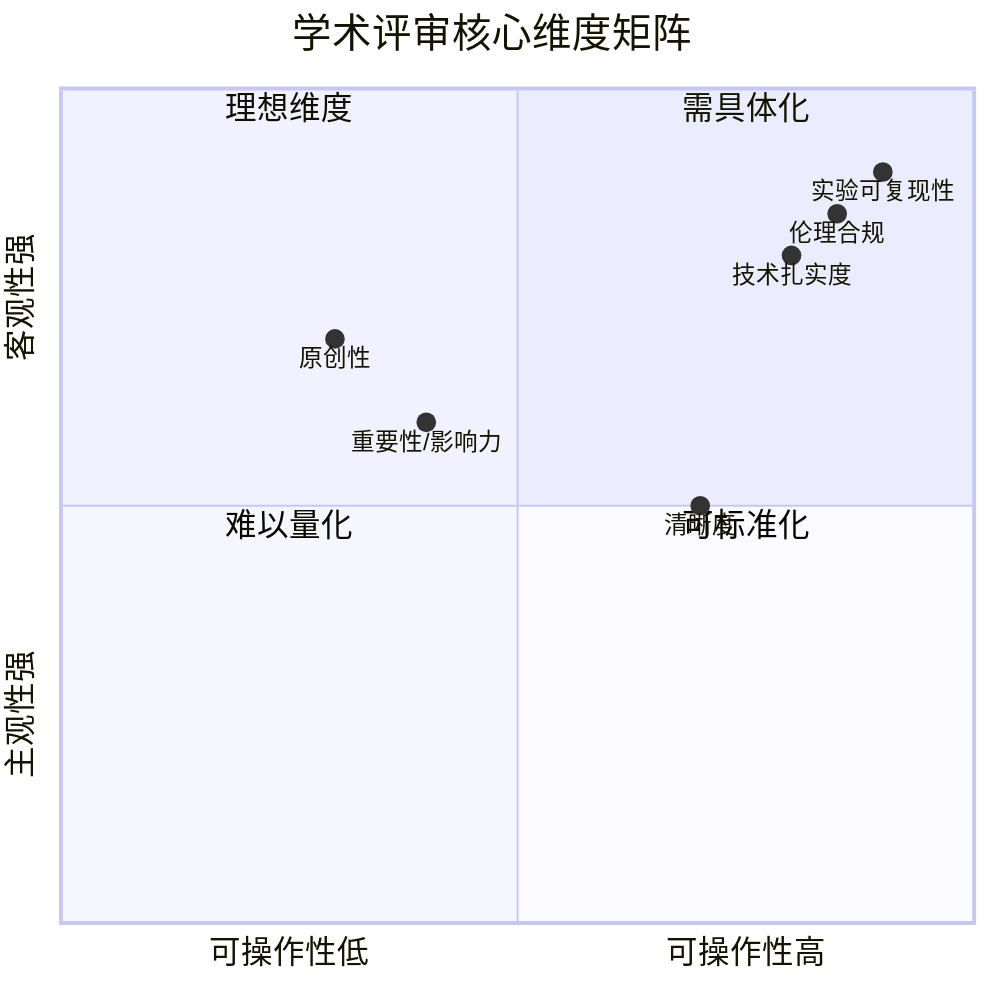
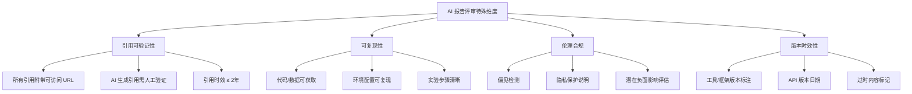
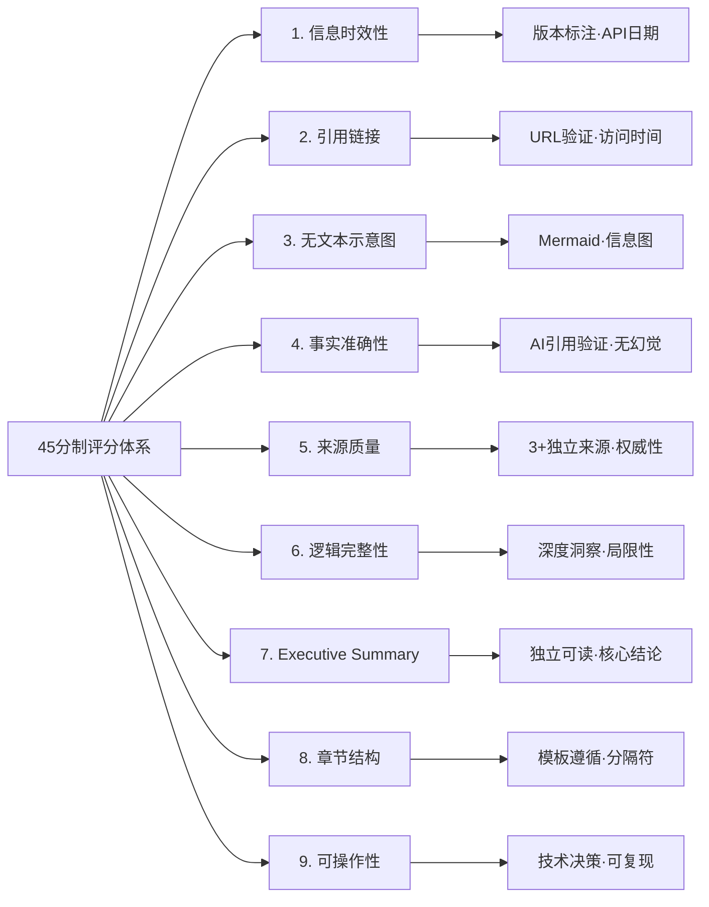

# 技术报告质量评审标准与评分体系设计

## Executive Summary

技术报告的质量评审是学术研究与工程实践中不可或缺的环节。本报告系统梳理了三大评审标准来源——学术会议评审体系（以 NeurIPS、ICML 为代表）、业界文档质量标准（以 Google、Microsoft 为代表）、以及 AI 时代报告撰写的特殊需求——并在此基础上设计了一套**九维均等评分体系**。该体系包含 9 个核心维度、每个维度 5 分满分（总计 45 分），配有细化评分细则和可操作的审稿清单，适用于技术研究报告的质量控制与持续改进。

---

## 1. 学术会议评审标准体系

### 1.1 NeurIPS 2024 评审框架

NeurIPS 2024 的评审指南（Reviewer Guidelines）定义了学术论文评审的核心维度[1]：

- **原创性 (Originality)**：论文是否提出了新的想法或方法？原创性可以来自现有思想的创造性组合、新领域的应用、或去除已有理论的限制性假设。
- **质量 (Quality)**：技术是否扎实？实验设计是否合理？
- **清晰度 (Clarity)**：论文是否写得清楚、易读？
- **重要性 (Significance)**：工作是否对领域有足够影响？

NeurIPS 特别强调：评审完成后，被接受论文的评审意见和元评审将公开，这倒逼评审者给出建设性、专业化的反馈[1]。

### 1.2 ICML 2024 评审评分体系

ICML 2024 采用了更为结构化的评分量表[2]：

| 分数 | 含义 |
|------|------|
| 8: Strong Accept | 重要且有影响力的问题，方法新颖、评估优秀 |
| 7: Accept | 技术扎实，至少一个 AI 子领域有高影响，评估优秀 |
| 6: Weak Accept | 技术合理但贡献有限 |
| 5: Borderline | 技术可接受但有明显不足 |
| 4: Weak Reject | 有一定价值但不足以接受 |
| 3: Reject | 技术或评估有明显缺陷 |
| 2: Strong Reject | 严重技术缺陷、评估差、可复现性低 |
| 1: Definite Reject | 几乎没有可取之处 |

ICML 还引入了**伦理审查 (Ethics Review)** 机制，涵盖歧视/偏见、隐私安全、法律合规、研究诚信等方面[2]。

### 1.3 学术评审的核心维度抽象

从 NeurIPS 和 ICML 的实践中，可以抽象出学术评审的 6 个核心维度：

---

## 2. 业界文档质量评估标准

### 2.1 技术文档质量评估框架

业界对技术文档质量的评估已形成成熟框架。Utica University 的技术报告评审标准[3]将评分维度与权重设定为：

| 维度 | 权重 | 评估要点 |
|------|------|---------|
| 技术内容 | 20% | 分析方法、理论框架、数据支撑 |
| 结构与组织 | 15% | 逻辑流程、章节安排、过渡衔接 |
| 图表与方程 | 15% | 图表清晰、标注规范、支持正文 |
| 格式规范 | 15% | 封面页、目录、版式统一 |
| 语言表达 | 15% | 语法、拼写、用词准确度 |
| 引用与文献 | 15% | 来源正确标注、格式统一 |
| 专业性 | 5% | 整体呈现的专业感 |

这一权重分配的核心理念是：**技术内容是灵魂，但呈现方式同样决定读者是否能有效获取信息**。

### 2.2 Draft.dev 技术写作评估模型

Draft.dev 的评估框架[4]提出了三大类别十个属性：

**写作能力 (Writing Skills)**
- 语言规范性（Grammar & Style）
- 组织能力（Organization）
- 语言掌控力（Language Mastery）

**技术专业度 (Technical Expertise)**
- 观点发展（Idea Development）
- 知识深度（Depth of Knowledge）
- 市场需求匹配（Demand Alignment）
- 正确性（Correctness）

**工作习惯 (Work Habits)**
- 沟通响应性
- 对反馈的积极态度
- 独立工作能力

### 2.3 微软文档质量标准

Microsoft Learn 的文档体系[5]强调了技术文档的四大原则：
- **准确性**：技术内容正确无误
- **可发现性**：通过搜索和导航容易找到
- **可读性**：面向目标读者，语言清晰
- **完整性**：覆盖用户完成任务所需的所有信息

---

## 3. AI 时代报告撰写的特殊需求

### 3.1 AI 生成内容的引用验证

AI 时代的技术报告面临独特的引用风险。SemanticCite 系统[6]的研究表明，AI 生成的引用存在"幻觉"问题——看似可信的作者名、期刊名和年份可能是完全虚构的。

STARD-AI 报告指南[7]为 AI 诊断研究设定了最低报告标准，包括：
- 系统架构描述
- 训练数据的完整说明
- 评估指标的选择理由
- 局限性的明确陈述

### 3.2 AI 报告的特殊评审维度

基于上述研究，AI 时代的技术报告需要在传统评审维度上增加以下特殊考量：

---

## 4. 优化评分体系设计

### 4.1 均等评分模型

综合学术标准、业界实践和 AI 时代需求，本报告提出**九维均等评分体系**（Total = 45分 = 9 × 5）。每个维度同等权重（5分），避免加权偏差，同时通过维度细化标准体现调研精华[8][9]。该体系将可复现性、AI 特殊要求等调研成果融入各维度定义中。

| # | 维度 | 满分 | 核心考量 |
|---|------|------|---------|
| 1 | 信息时效性 | 5 | 内容、工具版本、API 日期的时效性 |
| 2 | 引用链接 | 5 | 所有引用附带可访问 URL，100% 可验证 |
| 3 | 无文本示意图 | 5 | Mermaid 图、信息图的数量与质量 |
| 4 | 事实准确性 | 5 | 技术内容正确无误，无幻觉引用 |
| 5 | 来源质量 | 5 | 来源权威性、独立性、可追溯性 |
| 6 | 逻辑完整性 | 5 | 分析有深度，超越表面描述 |
| 7 | Executive Summary | 5 | 摘要可独立理解，涵盖核心结论 |
| 8 | 章节结构 | 5 | 章节顺序规范，模板遵循度 |
| 9 | 可操作性 | 5 | 结论对读者有实际指导价值 |

### 4.2 各维度评分细则

#### 1. 信息时效性（5分）

| 分值 | 标准 |
|------|------|
| 5 | 所有引用 ≤ 2年，工具/框架标注版本号（如 LangChain 0.3.0），API 标注版本日期 |
| 4 | 大部分引用 ≤ 2年，旧文献均标注原因，版本号基本完整 |
| 3 | 时效分布不均，部分引用超过 2年且未说明原因 |
| 2 | 过时内容较多，缺少版本标注 |
| 0-1 | 信息严重过时，无任何时效标注 |

#### 2. 引用链接（5分）

| 分值 | 标准 |
|------|------|
| 5 | 所有引用附带可访问 URL，标注访问时间，100% 可验证 |
| 4 | 大部分引用有 URL，个别访问失败但有替代来源 |
| 3 | 引用有 URL 但验证不完整，缺少部分访问时间 |
| 2 | URL 缺失较多，验证覆盖率 < 70% |
| 0-1 | 大量引用无 URL 或不可验证 |

#### 3. 无文本示意图（5分）

| 分值 | 标准 |
|------|------|
| 5 | Mermaid 图 ≥ 1 张 + 信息图，有效传达核心观点，无纯文本示意图 |
| 4 | 有 Mermaid 图和信息图，但部分图表与内容关联较弱 |
| 3 | 图表数量不足（缺 Mermaid 或信息图之一），或质量一般 |
| 2 | 仅有少量低质量图表，或存在纯文本示意图 |
| 0-1 | 无图表或图表与内容无关 |

#### 4. 事实准确性（5分）

| 分值 | 标准 |
|------|------|
| 5 | 技术内容准确无误，AI 生成引用已人工验证，无幻觉引用 |
| 4 | 技术内容基本准确，个别细节有误但不影响主体 |
| 3 | 存在少量事实错误，但核心论点成立 |
| 2 | 多处事实错误，影响可信度 |
| 0-1 | 关键事实错误，或存在未验证的 AI 生成引用 |

#### 5. 来源质量（5分）

| 分值 | 标准 |
|------|------|
| 5 | 关键论点有 3+ 独立来源，含官方文档和权威分析 |
| 4 | 大部分论点有多来源支撑，个别仅有单一来源 |
| 3 | 来源数量勉强够用（2-3个），权威性一般 |
| 2 | 来源单一或权威性不足 |
| 0-1 | 无可靠来源，或来源不可追溯 |

#### 6. 逻辑完整性（5分）

| 分值 | 标准 |
|------|------|
| 5 | 分析有深度，有独到洞察，超越表面罗列；结论与证据链完整；说明了方法/模型的局限性 |
| 4 | 分析较深入，但洞察力一般；基本覆盖因果关系 |
| 3 | 分析停留在描述层面，缺乏深度 |
| 2 | 逻辑跳跃明显，论证不充分 |
| 0-1 | 无分析，纯信息堆砌 |

#### 7. Executive Summary（5分）

| 分值 | 标准 |
|------|------|
| 5 | 摘要独立可读，涵盖背景、核心发现、关键结论（读者不读正文也能理解） |
| 4 | 摘要基本完整，但需结合正文才能完全理解 |
| 3 | 摘要过于简略，缺少关键结论 |
| 2 | 摘要结构混乱，与正文关联弱 |
| 0-1 | 无摘要或摘要完全不可用 |

#### 8. 章节结构（5分）

| 分值 | 标准 |
|------|------|
| 5 | 严格遵循：Executive Summary → 正文 → 结论 → 参考文献；含 `<!-- REFERENCE START -->` 分隔符；引用格式 [n] 与参考文献一一对应 |
| 4 | 章节顺序正确，格式基本规范，有轻微偏差 |
| 3 | 章节顺序有误或缺少关键分隔符 |
| 2 | 结构松散，章节间缺乏逻辑衔接 |
| 0-1 | 结构混乱，无法导航 |

#### 9. 可操作性（5分）

| 分值 | 标准 |
|------|------|
| 5 | 读者能直接基于结论做出技术决策；附带代码/数据/环境配置，可复现 |
| 4 | 结论有价值，提供关键步骤和工具版本，基本可复现 |
| 3 | 结论偏泛，实操指导不足；有工具提及但缺配置细节 |
| 2 | 结论缺乏针对性，无法指导行动 |
| 0-1 | 结论无实际价值 |

### 4.3 评分等级对照

| 总分 | 等级 | 行动 |
|------|------|------|
| 40-45 | ⭐ 优秀 | 直接发布 |
| 32-39 | ✅ 良好 | 微调后发布 |
| 24-31 | ⚠️ 需修改 | 明确修改意见后重审 |
| 0-23 | ❌ 不合格 | 打回重写 |

---

## 5. 审稿清单 (Review Checklist)

采用分析型评分量表（Analytic Rubric），逐维度评估比整体评分更具可操作性[9]。审稿清单按 45 分制九大维度组织，每项对应 5 分评分。

### 5.1 时效与引用清单（维度 1-2，满分 10）

- [ ] 所有引用时效是否 ≤ 2年？旧文献是否说明原因？
- [ ] 工具/框架是否标注了版本号？API 是否标注版本日期？
- [ ] 所有参考文献是否附带可访问 URL？
- [ ] 是否标注了访问时间？
- [ ] 引用链接是否 100% 可验证？

### 5.2 可视化与准确性清单（维度 3-4，满分 10）

- [ ] Mermaid 图是否 ≥ 1 张？是否有效传达核心观点？
- [ ] 是否有信息图（由调色板生成）？
- [ ] 是否存在纯文本示意图？（应避免）
- [ ] 技术内容是否准确无误？
- [ ] AI 生成的引用是否已人工验证？（详见 AI 引用最佳实践[10]）

### 5.3 来源与分析清单（维度 5-6，满分 10）

- [ ] 关键论点是否有 3+ 独立来源支撑？
- [ ] 来源是否包含官方文档或权威分析？
- [ ] 技术分析是否超越表面描述？
- [ ] 结论是否有完整的证据链支撑？
- [ ] 是否说明了方法/模型的局限性？

### 5.4 结构与可操作性清单（维度 7-9，满分 15）

- [ ] Executive Summary 是否可独立理解？涵盖背景、核心发现、关键结论？
- [ ] 章节是否按：Executive Summary → 正文 → 结论 → 参考文献 排列？
- [ ] 是否包含 `<!-- REFERENCE START -->` 分隔符？
- [ ] 正文引用标记 [n] 是否与参考文献序号一一对应？
- [ ] 结论是否可操作、能指导技术决策？
- [ ] 是否提供了代码/数据/环境配置，读者可复现？
- [ ] 是否评估了潜在负面影响？

---

## 6. 结论

本报告通过系统分析三大来源的评审标准，构建了一套适合技术研究报告的**九维均等评分体系**（45 分制）。该体系的核心设计原则包括：

1. **均等维度**：9 个维度 × 5 分，避免加权偏差，每项都不可忽视
2. **调研精华融合**：将可复现性融入"可操作性"维度，AI 特殊要求融入"事实准确性"和"信息时效性"维度
3. **5 分梯度细化**：每维度 1-5 分均有明确标准，消除评审主观性
4. **清单化执行**：四大审稿清单对应 9 个维度，让审稿从"凭感觉"变为"按清单逐项检查"

这套体系既借鉴了学术会议的严谨性，又融入了业界文档的实用性，是技术研究报告质量控制的有效工具。

<!-- REFERENCE START -->
## 参考文献

1. NeurIPS. "2024 Reviewer Guidelines" (2024). https://neurips.cc/Conferences/2024/ReviewerGuidelines
2. ICML. "Reviewer Instructions 2024" (2024). https://icml.cc/Conferences/2024/ReviewerInstructions
3. Utica University. "Technical Report Evaluation Rubric" (n.d.). https://www.utica.edu/academic/Assessment/new/technical%20report%20rubric.pdf
4. Draft.dev. "How to Create a Technical Writing Rubric" (2024). https://draft.dev/learn/technical-writing-rubric
5. Microsoft. "Technical Documentation - Microsoft Learn" (2025). https://learn.microsoft.com/en-us/docs/
6. SemanticCite. "Citation Verification with AI-Powered Full-Text Analysis" (2025). https://arxiv.org/html/2511.16198v1
7. Nature Medicine. "The STARD-AI reporting guideline for diagnostic accuracy studies" (2025). https://www.nature.com/articles/s41591-025-03953-8
8. Product School. "Weighted Scoring Model: Step-by-Step Implementation Guide" (2024). https://productschool.com/blog/product-fundamentals/weighted-scoring-model
9. Brown University. "Designing Grading Rubrics" (2024). https://sheridan.brown.edu/resources/course-design/feedback-student-learning/grading-criteria-rubrics/designing-grading
10. Human Writes AI. "Best Practices for AI-Generated Citations" (2025). https://humanwritesai.com/blog/best-practices-for-citations
