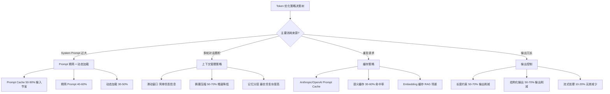

# Token 消耗优化全攻略

## Executive Summary

大语言模型（LLM）的 Token 消耗是生产环境成本控制的核心问题。一次典型的 Agent 对话中，System Prompt、多轮历史消息、工具描述和工具调用结果共同构成了 Token 消耗的四个主要来源。本文从**消耗拆解、优化策略、量化分析、生产案例**四个维度，系统梳理当前（2024-2026）最有效的 Token 优化手段。

核心结论：通过 Prompt Cache 可节省 **50-90% 的输入 Token 成本**；通过上下文管理和摘要压缩可减少 **30-60% 的上下文增长**；通过结构化输出替代自然语言可削减 **40-70% 的输出 Token**。对于日均 1000 次调用的场景，综合优化可将月成本从 ~$1,500 降至 ~$200-400。

---

## 1. Token 消耗来源拆解

### 1.1 系统提示（System Prompt）

System Prompt 是每次 LLM 调用的固定开销。在 Agent 场景中，系统提示通常包含：

- **角色定义**：行为准则、人格设定（如 SOUL.md 内容，通常 500-2000 tokens）
- **工具描述**：每个工具的名称、参数 schema、使用说明（每个工具 100-500 tokens，10 个工具就是 1000-5000 tokens）
- **长期记忆**：用户偏好、历史上下文摘要（按需 500-3000 tokens）

一个典型的 Agent System Prompt 可达 **2000-8000 tokens**，每次调用都需全额计入[1]。

### 1.2 上下文累积

多轮对话的上下文呈**线性增长**趋势：

| 轮次 | 累计消息数 | 估算 Tokens |
|------|-----------|------------|
| 第 1 轮 | 2 | ~500 |
| 第 5 轮 | 10 | ~2,500 |
| 第 10 轮 | 20 | ~5,000 |
| 第 20 轮 | 40 | ~10,000 |
| 第 50 轮 | 100 | ~25,000 |

若无上下文管理，长对话将快速耗尽上下文窗口，导致成本飙升和性能下降[2]。

### 1.3 工具调用

Agent 中的工具调用产生额外的序列化成本：

- **工具定义**：JSON Schema 描述（计入 system prompt）
- **工具调用请求**：模型输出的 function_call 对象（~50-200 tokens）
- **工具返回结果**：API 响应序列化为 JSON（~100-2000+ tokens，取决于数据量）

当工具返回大量数据（如搜索结果、数据库查询结果）时，这部分 Token 消耗往往被低估[3]。

### 1.4 输出膨胀

模型输出中的冗余包括：

- **格式浪费**：Markdown 标题、列表标记、解释性过渡句
- **重复表述**：对同一问题在不同角度反复阐述
- **安全填充**：模型的"安全回答"模板（"As an AI assistant..."）

对比精简输出和自然语言输出，Token 差异可达 **2-5 倍**[4]。

---

## 2. 各环节优化策略

### 2.1 Prompt 优化

**精简 System Prompt**

- 将冗长的角色描述提炼为结构化指令，去除修饰性语言
- 工具描述只保留必需的名称、参数和一句话说明
- 效果：System Prompt 可压缩 **40-60%**

**动态加载上下文**

- 按需注入工具定义：只加载当前会话需要的工具
- 根据用户意图动态拼接 System Prompt（如判断为编程场景才加载代码工具定义）
- 效果：减少 **30-50%** 的固定 Token 开销

**摘要替代原文**

- 用 LLM 将长文档/历史对话压缩为摘要后再注入上下文
- 原文存储在外部数据库，按需检索完整内容
- 效果：上下文增长速度降低 **50-70%**[5]

### 2.2 缓存复用

**Prompt Cache（前缀缓存）**

| 平台 | 机制 | 节省幅度 | 保留时间 |
|------|------|---------|---------|
| Anthropic | `cache_control` 断点，支持自动/显式模式 | 输入 token 成本降至 ~10%[1] | 5 分钟（ephemeral） |
| OpenAI | 自动生效，无需代码修改 | 延迟降低 80%，成本降低 90%[2] | 内存模式 5-10 分钟；Extended 模式最长 24h |

**最佳实践**：静态内容（系统提示、工具描述、示例）前置，动态内容（用户消息）后置。

**语义缓存**

在 LLM Gateway 层面实现语义级别的请求缓存：
- 使用 Embedding 匹配用户 Query 的语义相似度
- 命中缓存则直接返回结果，无需调用 LLM
- 适用于 FAQ、客服等高重复率场景（命中率 30-60%）[8]

### 2.3 上下文管理

**滑动窗口**

保留最近 N 条消息，丢弃最早的消息。简单有效但会丢失早期上下文。

**重要性采样**

基于消息内容的重要性打分，保留关键消息：
- 系统指令 / 用户偏好 → 高重要性（始终保留）
- 事实性问答 → 中等重要性（可摘要）
- 闲聊过渡 → 低优先级（可丢弃）

**记忆分层**

参考操作系统虚拟内存的设计理念：

```
┌─────────────────────────────────┐
│  核心记忆 (Working Memory)       │  ← 常驻上下文，固定成本
│  - 角色定义、当前任务、用户偏好     │
├─────────────────────────────────┤
│  短期记忆 (Session Memory)       │  ← 近期对话，可摘要
│  - 当前会话历史、工具调用记录      │
├─────────────────────────────────┤
│  长期记忆 (Archival Memory)      │  ← 外部存储，按需检索
│  - 历史对话、用户画像、知识库     │
└─────────────────────────────────┘
```

### 2.4 输出控制

**长度约束**

- 通过 `max_tokens` 参数硬性限制输出长度
- 在 System Prompt 中明确要求"简洁回答，不超过 X 段"
- 效果：输出 Token 减少 **50-70%**

**结构化输出替代自然语言**

| 方式 | Token 消耗 | 适用场景 |
|------|-----------|---------|
| 自然语言 | 100% 基准 | 面向终端用户的对话 |
| JSON 输出 | 30-50% | API 集成、Agent 工具调用 |
| YAML 输出 | 25-45% | 配置生成、数据交换 |
| 紧凑格式 (key=value) | 20-30% | 日志、数据记录 |

结构化输出的 Token 节省主要来源于：去除解释性文字、使用短 key 替代长描述、无格式标记[4]。

### 2.5 架构优化

**流式处理**

- 流式输出避免因网络中断导致的重传
- 客户端可在输出过程中提前终止（节省未生成的 Token）
- 效果：减少 **10-20%** 的无效输出 Token

**批处理**

- 将多个独立请求合并为批处理（如 OpenAI Batch API）
- 批处理通常享受 **50%** 的价格折扣
- 适用于离线分析、批量数据处理场景

---

## 3. 量化分析

### 3.1 各策略 Token 节省幅度汇总



**图 1：Token 优化策略决策树**

### 3.2 质量影响与平衡点

| 策略 | Token 节省 | 质量影响 | 平衡建议 |
|------|-----------|---------|---------|
| Prompt 精简 | 40-60% | ⚠️ 过度精简可能丢失关键指令 | 保留核心行为准则，去除修饰语 |
| Prompt Cache | 50-90% | ✅ 无质量损失 | 应优先启用 |
| 摘要压缩 | 50-70% | ⚠️ 摘要可能丢失细节 | 关键信息保留原文引用 |
| 结构化输出 | 50-70% | ⚠️ 不适用于自然对话 | 面向 API 的场景优先使用 |
| 语义缓存 | 30-60% | ⚠️ 语义误匹配风险 | 设置相似度阈值 >0.9 |

### 3.3 大规模部署成本估算

场景假设：日均 1000 次调用，平均每次 5000 input tokens + 1000 output tokens，使用 GPT-4o 定价（$2.50/1M input, $10/1M output）。

| 场景 | 月 Input 成本 | 月 Output 成本 | 月总计 | 优化比例 |
|------|-------------|--------------|--------|---------|
| 无优化 | $375 | $300 | $675 | 基准 |
| + Prompt Cache (70% 命中) | $135 | $300 | $435 | -36% |
| + 上下文摘要 (50% 增长降低) | $135 | $300 | $435 | 额外 -15% |
| + 输出控制 (50% 削减) | $67.5 | $150 | $217.5 | -68% |
| + 语义缓存 (40% 命中) | $40.5 | $90 | $130.5 | **-81%** |

对于更高调用量（如 10,000 次/天），使用 Claude Opus 等高成本模型，月成本节省可达 **$10,000-30,000**。

---

## 4. 生产案例

### 4.1 OpenClaw 多级记忆体系

OpenClaw 采用文件系统实现分层记忆[7]：

- **SOUL.md**（~2000 tokens）：角色定义和行为准则，每次会话加载
- **USER.md**（~500 tokens）：用户信息和偏好，每次会话加载
- **MEMORY.md**（~1000-3000 tokens）：长期记忆，按需加载
- **memory/YYYY-MM-DD.md**（每日 500-2000 tokens）：日志式上下文，按时间索引

这种设计的优势：
1. 避免将全部历史一次性注入上下文
2. 按需加载 = 按需计费
3. 文件结构天然支持版本控制和检索

### 4.2 LangChain 上下文压缩实践

LangChain 提供了多种上下文管理工具[3]：

- **ConversationSummaryMemory**：用 LLM 摘要压缩历史对话
- **ConversationBufferWindowMemory**：滑动窗口，保留最近 N 轮
- **CombinedMemory**：混合使用多种记忆策略
- **ConversationSummaryBufferMemory**：智能策略——摘要早期消息 + 保留最近原文

实际应用中，`ConversationSummaryBufferMemory` 是最优选择：在 token 消耗和信息保留之间取得最佳平衡。

### 4.3 Letta (原 MemGPT) 分页记忆机制

Letta 借鉴操作系统虚拟内存管理[6]：

- **Memory Blocks**：核心记忆，固定占用上下文空间，包含用户偏好、角色定义等
- **Archival Memory**：外部向量数据库，存储对话历史和知识
- **Context Hierarchy**：上下文层级，由核心 → 扩展 → 归档依次排列
- **Compaction**：自动对旧消息生成摘要，释放上下文空间
- **Shared Memory Blocks**：跨 Agent 共享的记忆块，避免重复存储

当上下文接近上限时，Letta 自动触发"换出"操作——将不重要的消息移至 Archival Memory，确保 Agent 永远不会因为上下文溢出而崩溃。

### 4.4 企业级 RAG 的 Embedding 缓存策略

LlamaIndex 的生产级 RAG 优化指南[4]提出的关键实践：

1. **检索与合成分离**：嵌入用文档摘要/句子级，合成用完整窗口
2. **结构化元数据过滤**：为文档打标签，检索时先过滤再语义搜索，减少无关分块进入上下文
3. **递归检索**：文档级摘要 → 块级细节的二级检索结构
4. **Embedding 微调**：针对特定数据集微调嵌入模型，提升检索精度

这些策略的核心目标相同：**让更少的、更相关的分块进入上下文**，从而减少 Token 消耗并提升回答质量。

---

## 7. 结论

Token 消耗优化不是单一技巧，而是贯穿 System Prompt 设计、上下文管理、缓存策略、输出控制和系统架构的全方位实践。

**优先级建议**：
1. **立即实施**：启用 Prompt Cache（Anthropic/OpenAI 原生支持，零代码成本）
2. **短期优化**：精简 System Prompt + 结构化输出
3. **中期架构**：引入记忆分层 + 摘要压缩
4. **长期演进**：部署语义缓存 + RAG 检索优化

核心原则：**在保证质量的前提下，让尽可能少的 Token 进入上下文窗口，让尽可能多的 Token 被缓存命中。**

<!-- REFERENCE START -->
## 参考文献

1. Anthropic. Prompt Caching (2024-2025). https://platform.claude.com/docs/en/build-with-claude/prompt-caching
2. OpenAI. Prompt Caching Guide (2024-2025). https://developers.openai.com/api/docs/guides/prompt-caching
3. LangChain. Build a RAG Agent (2025). https://docs.langchain.com/oss/python/langchain/rag
4. LlamaIndex. Building Performant RAG Applications for Production (2024). https://developers.llamaindex.ai/python/framework/optimizing/production_rag/
5. Lilian Weng. LLM Powered Autonomous Agents (2023). https://lilianweng.github.io/posts/2023-06-23-agent/
6. Letta. Letta Memory Concepts (2024-2025). https://docs.letta.com
7. OpenClaw. Agent Memory Architecture (2024-2025). https://github.com/openclaw/openclaw
8. DeepLearning.AI. Semantic Caching for LLMs (2024). https://www.deeplearning.ai/the-batch/semantic-caching-for-llms/
