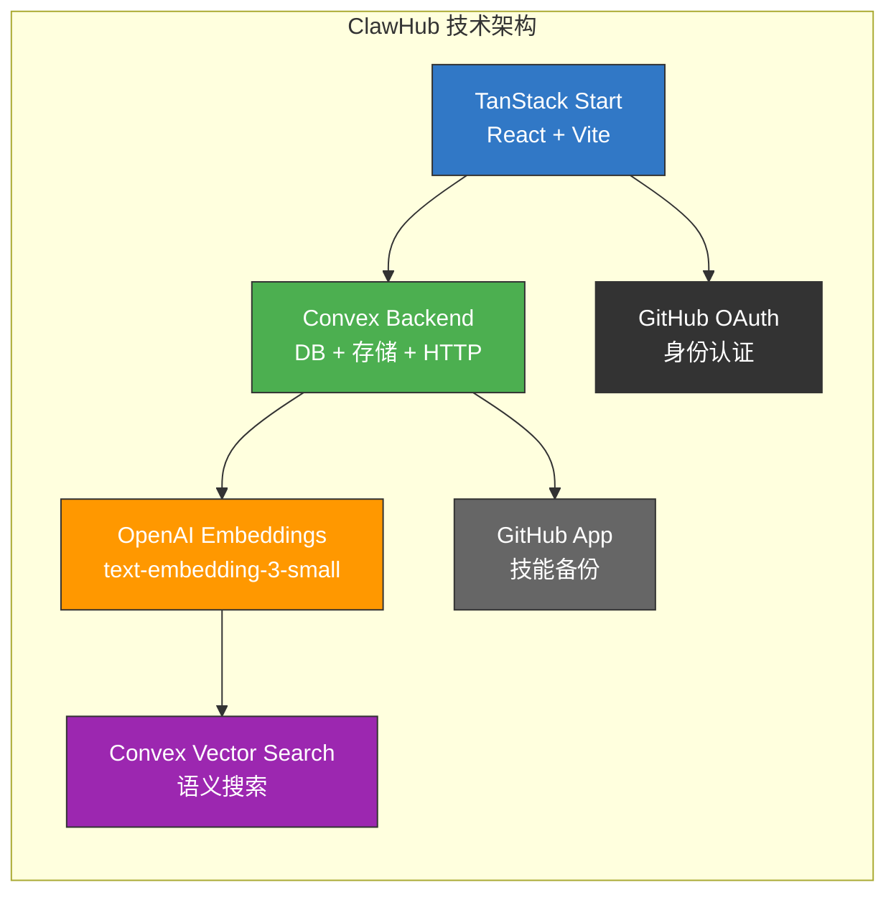
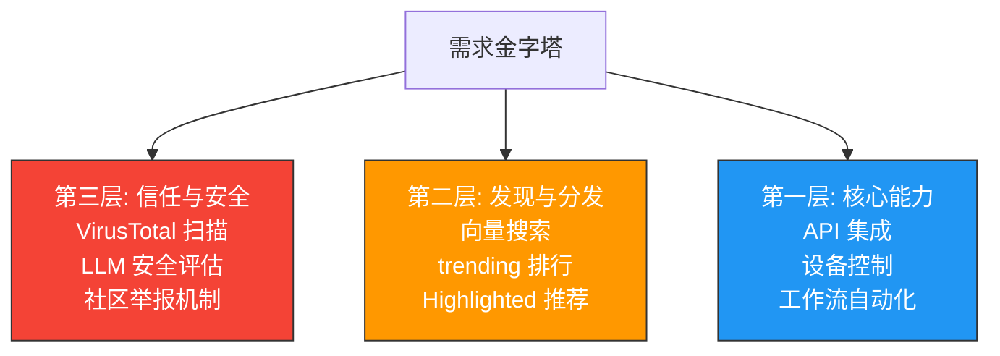

# Agent 技能生态观察：ClawHub 热门技能背后的需求图谱

> **作者**: 探针团队
> **发布日期**: 2026-03-18
> **状态**: 已完成

---

## 1. Executive Summary

**ClawHub 在短短 10 周内从零增长到 6.2k GitHub Stars 和 972 Forks，表明 AI Agent 技能市场正处于爆发前夜。** 这个由 OpenClaw 项目孵化的技能注册中心，已经从一个简单的技能目录演变为一个拥有完整版本管理、向量搜索、多层安全审核和社区治理的成熟生态系统。

**开发者对技能的需求集中在"让 AI 真正能做事"——API 集成、设备控制和工作流自动化是最核心的刚需场景。** 从 ClawHub 的排序机制（默认按 downloads/installs 排序而非 stars）可以看出，平台优先衡量的是实际使用量而非兴趣度，这反映了开发者追求的是能落地的技能，不是锦上添花的 demo。

**安全与信任是当前生态建设的最大投资方向。** 从 v0.5.0 到 v0.8.0 的 8 个版本中，平台新增了 VirusTotal 扫描、LLM 安全评估、AI 驱动的评论反欺诈、GitHub 账号年龄门槛（≥14 天）等功能，安全审核能力的投入远超功能开发，这说明社区已经认识到：**没有信任的技能市场只会沦为恶意代码的分发渠道。**

**Agent 生态正在从"模型能力竞赛"转向"工具集成竞赛"，Nix 插件系统和 MCP 桥接模式是两个关键信号。** Nix 插件允许将技能包、CLI 二进制文件和配置要求打包在一起，代表了系统级集成的方向；而 OpenClaw 选择通过 mcporter 桥接 MCP 而非内置，显示了对"松耦合、可扩展"架构的偏好。下一步的竞争焦点将是：**谁能提供最丰富、最可信、最易发现的技能生态。**

---

## 2. ClawHub 平台全景：一个快速增长的 Agent 技能市场

### 2.1 平台概况

ClawHub（clawhub.ai）是 OpenClaw 项目的官方公共技能注册中心，由 Peter Steinberger（steipete）于 2026 年 1 月创建。截至 2026 年 3 月 18 日，项目的核心指标如下：

| 指标 | 数据 | 说明 |
|------|------|------|
| GitHub Stars | 6.2k | 10 周内增长 |
| Forks | 972 | 社区活跃度高 |
| Contributors | 79 | 分布式协作 |
| Commits | 764 | 高频迭代 |
| 版本发布 | v0.8.0（2026-03-13） | 约每周一个大版本 |

ClawHub 的技术栈选择反映了"快速迭代、开发者友好"的定位：

**关键设计决策**：ClawHub 选择向量搜索（而非关键词搜索）作为默认搜索方式，这预示着平台预期会有大量技能需要语义级别的发现能力——这是对生态规模的一个强烈信心信号。

### 2.2 技能的定义与格式

在 ClawHub 上，一个技能（Skill）是一个文件夹，核心文件是 `SKILL.md`——一份带有 YAML frontmatter 的 Markdown 文档。这个设计看似简单，实则精妙：

- **SKILL.md 既是文档也是配置**：frontmatter 声明运行时依赖（环境变量、二进制文件、安装依赖），正文提供使用说明
- **安全审核前置**：平台会检查声明的依赖与实际代码行为是否一致，声明不匹配会触发安全告警
- **向量搜索覆盖全文**：不仅搜索 SKILL.md，还会索引最多 40 个非 .md 文件

支持的依赖声明类型包括环境变量（`requires.env`）、CLI 工具（`requires.bins`）、包管理器安装（`install` 数组，支持 brew/node/go/uv），以及 Nix 插件规范。这种多层依赖声明机制使得 ClawHub 可以在用户安装前就展示完整的依赖图谱。

---

## 3. 热门技能分类与需求图谱

### 3.1 技能分类矩阵

基于 ClawHub 的文档、示例技能和排序机制，我们可以将技能分为六大核心类别。每个类别反映了开发者不同的需求层次：

| 排名 | 技能类别 | 代表技能 | 需求类型 | 刚需指数 |
|------|----------|----------|----------|----------|
| 1 | API 集成与自动化 | Todoist 任务管理、日历同步 | 高 | ★★★★★ |
| 2 | 设备与服务控制 | Sonos CLI（sonoscli）、Padel 预订 | 高 | ★★★★☆ |
| 3 | macOS 生产力工具 | Peekaboo（UI 自动化）、屏幕捕获 | 中高 | ★★★★☆ |
| 4 | 开发者工作流 | GitHub PR 自动化、部署工具 | 中高 | ★★★★☆ |
| 5 | 个人信息管理 | 笔记同步、提醒、任务管理 | 中 | ★★★☆☆ |
| 6 | 系统级 Nix 插件 | 系统配置、CLI 工具捆绑 | 低（高级用户） | ★★★☆☆ |

### 3.2 需求层次分析

从 ClawHub 的功能设计中，我们可以清晰看到开发者需求的三个层次：

**第一层（刚需）**：API 集成和设备控制是最基础的需求。开发者希望 AI Agent 能"真正做事"——管理 Todoist 任务、控制 Sonos 音响、预订运动场地。这些技能解决的是"从知道到做到"的鸿沟。

**第二层（生态需求）**：随着技能数量增长，发现能力变得关键。ClawHub 投入大量资源建设向量搜索、trending 排行、Highlighted 推荐系统，这是平台级需求。

**第三层（信任需求）**：安全审核是 ClawHub 变化最快的部分。从 v0.5.0 的用户举报到 v0.8.0 的 AI 驱动反欺诈，信任机制的迭代速度超过了功能开发，这是整个 Agent 生态的共同挑战。

### 3.3 "刚需" vs "锦上添花"的判断框架

根据 ClawHub 的数据信号，我们可以建立一个实用的区分标准：

**刚需技能的特征**：
- 高 installs/installsAllTime（实际安装量）
- 低 star-to-install ratio（兴趣容易转化为使用）
- 依赖声明简单明确（API key + curl 就够了）
- 解决日常重复性任务

**锦上添花技能的特征**：
- 高 stars 但低 installs（看着酷但不常用）
- 复杂的依赖声明（需要 Nix、特殊二进制等）
- 解决的问题本身不频繁发生
- 更多是"展示可能性"而非"解决问题"

ClawHub 的排序选项（默认 downloads，可选 installs、stars、trending）本身就是一个设计信号：**平台鼓励用户按实际使用量而非兴趣度来发现技能。**

---

## 4. 技能热度趋势与生态演进方向

### 4.1 版本迭代节奏揭示的投资方向

分析 ClawHub 从 v0.3.0（2026-01-19）到 v0.8.0（2026-03-13）的 8 个版本的新增功能，可以清晰看到资源投入的优先级：

| 版本 | 日期 | 安全/审核功能 | 发现/搜索功能 | 核心功能 |
|------|------|-------------|-------------|----------|
| v0.3.0 | 01-19 | — | trending 排行、explore 命令 | 星标 API |
| v0.4.0 | 01-30 | — | 用户主页技能展示 | GitHub 配置支持 |
| v0.5.0 | 02-02 | 用户封禁、举报自动隐藏、年龄门槛 | — | CLI inspect 命令 |
| v0.6.0 | 02-10 | VirusTotal 扫描、隔离机制 | — | 用户角色管理 |
| v0.6.1 | 02-13 | LLM 安全评估 | 向量搜索改进 | 懒加载优化 |
| v0.7.0 | 02-16 | 反垃圾发布、信任分级 | 非可疑技能过滤 | 自动摘要生成 |
| v0.8.0 | 03-13 | AI 反欺诈评论、审计工具 | 技能所有者展示 | 所有权转移流程 |

**关键趋势**：安全/审核功能的投入逐版本加速，从简单的用户封禁发展到 AI 驱动的反欺诈和 VirusTotal 集成，这是生态成熟化的标志。

### 4.2 Agent 生态的下一步演进

基于 ClawHub 的发展轨迹和 OpenClaw 的 VISION.md，我们可以预测 Agent 技能生态的四个演进方向：

**方向一：从脚本到系统级集成**
Nix 插件系统的引入是一个分水岭。传统技能只是"一个 SKILL.md + 一些脚本"，Nix 插件则将技能包、CLI 二进制文件和系统配置打包在一起。这意味着 Agent 能力从"调用 API"扩展到"操作系统级集成"。

**方向二：从松散工具到可信供应链**
VirusTotal 扫描 + LLM 安全评估 + 社区举报的三层机制，正在把技能市场从"自由集市"变成"可信供应链"。未来的技能将带有可验证的安全证书。

**方向三：从手动发现到智能推荐**
向量搜索 + trending 排行 + Highlighted 推荐的组合，正在从"你搜索"转向"它推荐"。ClawHub 的向量搜索使用 OpenAI 的 text-embedding-3-small，这意味着语义理解将成为技能发现的默认方式。

**方向四：从单一平台到跨平台分发**
OpenClaw 的愿景涵盖 macOS、iOS、Android、Windows 和 Linux 的 Companion App。技能将需要适应多平台环境，OS 限制声明（`metadata.openclaw.os`）已经是这一趋势的早期信号。

### 4.3 MCP 桥接模式的影响

OpenClaw 选择通过 mcporter 桥接 MCP（Model Context Protocol），而不是在核心中内置 MCP 运行时。这个决策对技能生态有深远影响：

- **降低核心复杂性**：MCP 服务器的变更不会影响核心稳定性
- **提高灵活性**：用户可以随时添加或更换 MCP 服务器，无需重启
- **技能作为 MCP 的补充**：技能提供更高层的抽象（SKILL.md + 脚本），MCP 提供标准化的工具协议

这种"技能 + MCP 桥接"的双层架构可能成为 Agent 生态的主流模式。

---

## 5. 对技能开发者的建议

### 5.1 选题策略

**优先解决高频、重复性问题**。从 ClawHub 的排序机制和用户反馈来看，日用型技能（API 集成、设备控制、工作流自动化）的安装量远高于实验型技能。一个好的选题应该问：**"这个问题每隔几天就会出现一次吗？"**

**从自己的痛点出发**。OpenClaw 的创建者 Peter Steinberger 明确表示项目始于个人需求。最好的技能往往来自开发者自己的真实痛点——你每天都要手动做的事情，Agent 也应该能做。

### 5.2 技能设计原则

| 原则 | 说明 | 示例 |
|------|------|------|
| 依赖声明准确 | frontmatter 必须准确声明所有环境变量和二进制依赖 | `requires.env: [TODOIST_API_KEY]` |
| SKILL.md 即文档 | 正文要包含使用说明、示例、权限要求 | 清晰的步骤 + 示例命令 |
| 安全最小权限 | 只声明必要的权限，避免过度请求 | 只用 curl 就够的别要求完整 Python 环境 |
| 平台兼容性 | 声明 OS 限制，避免隐式依赖 | `os: [macos]` 对于 macOS 特定工具 |

### 5.3 发布与推广策略

1. **首次发布时写好 changelog**：ClawHub 会在 changelog 为空时自动生成，但手动编写的 changelog 更能体现专业性
2. **利用 trending 机制**：在发布后积极推广，争取早期 installs，进入 trending 排行
3. **维护版本更新**：ClawHub 支持版本管理，持续更新比一次性发布更有长期价值
4. **参与社区**：评论、star 其他技能、回应 issue，建立开发者声誉

### 5.4 需要避免的陷阱

- **不要发布空壳技能**：ClawHub 有 anti-spam 发布上限和空技能清理工具
- **不要隐藏依赖**：LLM 安全评估会检测 frontmatter 声明与实际代码的不匹配
- **不要急于求成**：GitHub 账号年龄需 ≥14 天才能发布，这是平台的反垃圾门槛
- **不要忽略 Nix 插件机会**：对于需要 CLI 二进制的复杂工具，Nix 插件是官方推荐的分发方式

---

## 6. 结论

ClawHub 的快速发展揭示了 AI Agent 生态的核心洞察：**开发者需要的不是更多的 AI 模型，而是更多能让 AI 做事的工具。** 从 API 集成到设备控制，从工作流自动化到系统级配置，技能生态正在填补"AI 知道什么"和"AI 能做什么"之间的鸿沟。

平台对安全审核的巨大投入（VirusTotal、LLM 评估、AI 反欺诈）表明，信任是技能市场能否规模化的关键变量。未来成功的技能开发者不仅需要解决真实问题，还需要在安全和透明度上建立可信度。

ClawHub 的向量搜索、trending 排行和 Nix 插件系统构成了一个完整的"发现-信任-使用"闭环。对于开发者而言，现在是进入这个生态的最佳时机——平台仍在快速迭代，竞争尚未白热化，而先行者的优势在于建立声誉和占据关键技能位置。

---

## 参考来源

1. **OpenClaw Team** — ClawHub (2026-01)
    https://github.com/openclaw/clawhub

2. **Peter Steinberger** — OpenClaw Vision (2026)
    https://github.com/openclaw/clawhub/blob/main/VISION.md

3. **OpenClaw Team** — ClawHub Changelog v0.3.0-v0.8.0 (2026-01 to 2026-03)
    https://github.com/openclaw/clawhub/blob/main/CHANGELOG.md

4. **OpenClaw Team** — Skill Format Documentation (2026)
    https://github.com/openclaw/clawhub/blob/main/docs/skill-format.md

5. **ClawHub** — Homepage & Skills Browser (2026-03-18)
    https://clawhub.ai

6. **OpenClaw** — Official Website & Testimonials (2026)
    https://openclaw.ai

7. **OpenClaw Team** — ClawHub Product Spec (2026)
    https://github.com/openclaw/clawhub/blob/main/docs/spec.md

---
*本报告基于 2024-2026 年公开资料编写，引用均附真实 URL。*
