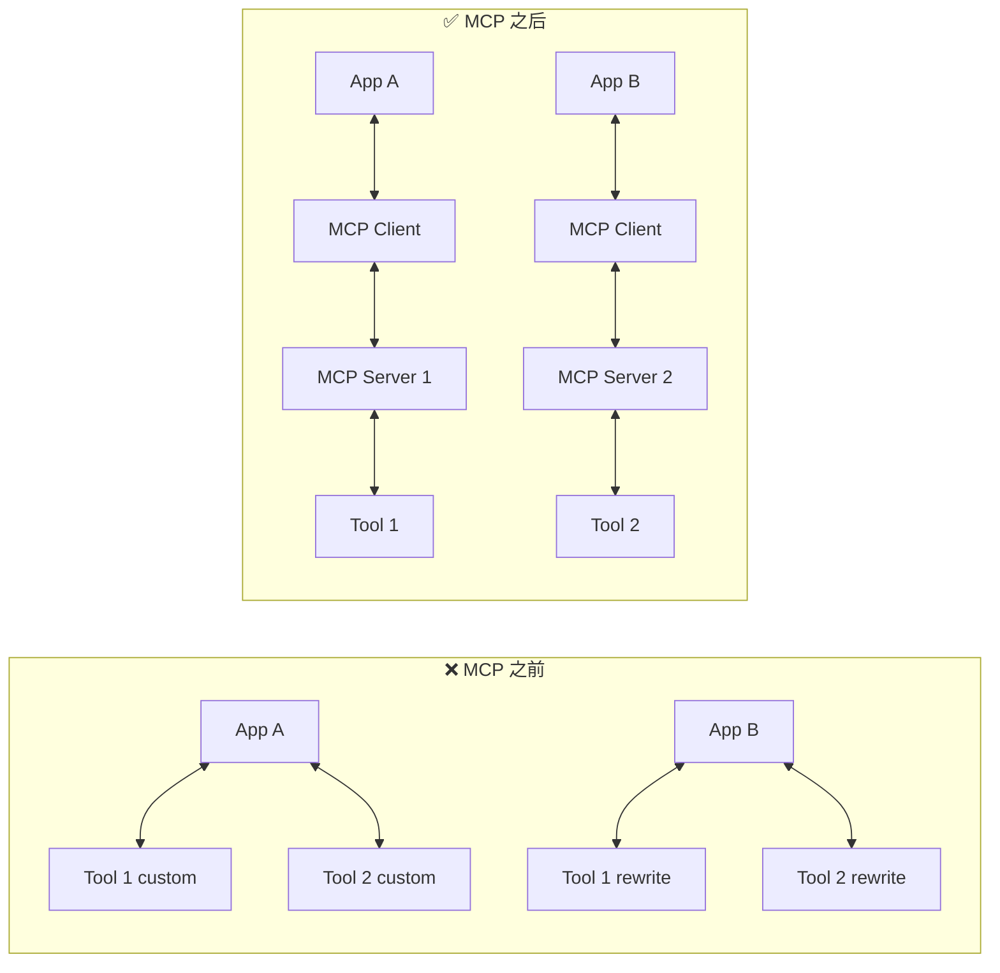
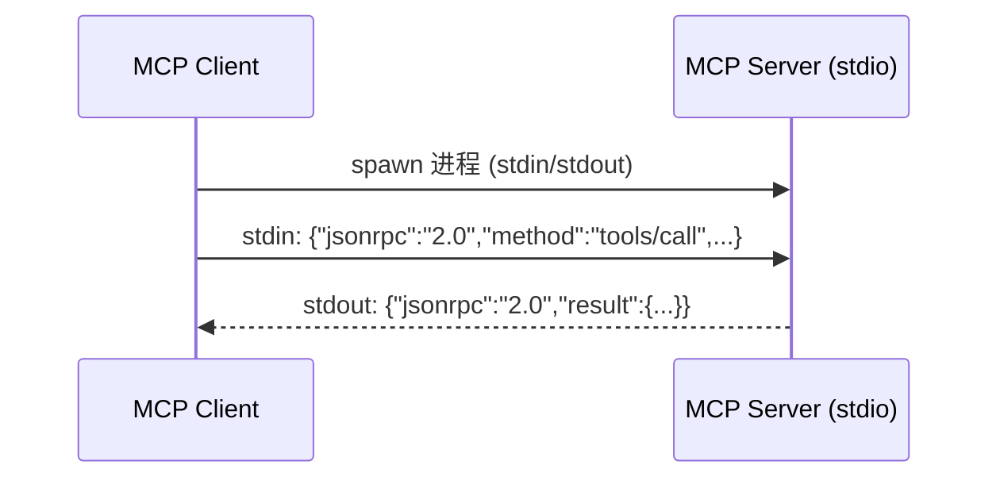

# MCP 协议生态深度分析

> 最后更新: 2026-03-14 | 分类: AI 基础设施 / 协议

---

## Executive Summary

Model Context Protocol (MCP) 是 Anthropic 于 2024 年 11 月发布的开放协议，旨在标准化 AI 模型与外部工具、数据源之间的连接方式。通过统一的客户端-服务端架构，MCP 让 AI 应用可以"即插即用"地接入各种工具和数据源，而无需为每个集成编写定制代码。

**截至 2025 年底**，MCP 已获得广泛采纳：主流 AI IDE（Cursor、Windsurf、Cline）、Agent 框架（LangChain、OpenClaw、Dify）和桌面应用（Claude Desktop）均已支持 MCP。生态中已有 1,000+ 开源 MCP Server 覆盖文件系统、数据库、云服务、开发工具等场景。

**核心结论**: MCP 正在成为 AI 工具集成的事实标准协议，其设计简洁、生态增长迅速。与 Function Calling 相比，MCP 解决了跨模型标准化和工具复用问题，两者互补而非替代。

---

## 1. MCP 设计原理

### 设计动机

在 MCP 出现之前，每个 AI 应用都需要为每个工具编写定制集成代码：



MCP 的核心价值是**解耦**: 工具提供方只需实现一次 MCP Server，任何 MCP Client 都可以使用。

### 协议层次

MCP 基于 JSON-RPC 2.0 协议，定义了三层能力：

1. **Tools（工具）**: AI 模型可调用的函数（类似 Function Calling）
   - 由 Client 发起调用请求
   - Server 执行并返回结果
   - 支持参数验证和错误处理

2. **Resources（资源）**: 可读取的数据上下文
   - 类似 GET 请求，提供只读数据
   - 支持 URI 模式访问（如 `file:///path`）
   - 可订阅变更通知

3. **Prompts（提示模板）**: 预定义的提示模板
   - Server 提供可复用的提示词
   - 支持参数化
   - 帮助标准化常见任务

### 传输层

MCP 支持两种传输方式：

| 传输方式 | 适用场景 | 说明 |
|---------|---------|------|
| **stdio** | 本地工具 | 通过标准输入输出通信，延迟最低 |
| **HTTP + SSE** | 远程服务 | 通过 HTTP 发送请求，SSE 推送事件 |



---

## 2. 服务端与客户端架构

### MCP Server 架构

一个 MCP Server 通常包含：

```python
# 简化的 MCP Server 结构
from mcp.server import Server

server = Server("my-tool")

@server.tool()
def search(query: str) -> str:
    """搜索功能"""
    return perform_search(query)

@server.resource("config://settings")
def get_config() -> str:
    """读取配置"""
    return load_config()

@server.prompt()
def summarize(text: str) -> str:
    """摘要提示模板"""
    return f"请总结以下内容:\n{text}"
```

**Server 生命周期**:
1. Client 启动 Server 进程（stdio）或连接 Server（HTTP）
2. 双方进行初始化握手（`initialize`）
3. Server 声明能力（Tools / Resources / Prompts）
4. Client 按需调用
5. 连接关闭或超时

### MCP Client 架构

MCP Client 内置于 AI 应用中，负责：

1. **发现**: 连接 Server 并获取可用工具列表
2. **调度**: 将工具信息注入 LLM 的 System Prompt
3. **执行**: 收到 LLM 的工具调用请求后，转发给对应 Server
4. **返回**: 将结果返回给 LLM

```mermaid
flowchart TD
    U[User] --> APP[AI App]
    APP --> MC[MCP Client]
    MC --> LLM[LLM]
    LLM -->|调用 search(query='...')| MC
    MC <--> MS[MCP Server(s)]
```

### 主流 Client 实现

| Client | 类型 | MCP 支持程度 |
|--------|------|-------------|
| Claude Desktop | 桌面应用 | ⭐ 原生支持，最早实现 |
| Cursor | AI IDE | ✅ 完整支持 |
| Windsurf | AI IDE | ✅ 完整支持 |
| Cline | VS Code 插件 | ✅ 完整支持 |
| OpenClaw | Agent 平台 | ✅ 完整支持 |
| LangChain | 框架 | ✅ 通过适配器 |
| Dify | LLMOps 平台 | ✅ 支持 |

---

## 3. 现有 MCP Server 生态

### 官方参考实现 (Anthropic)

| Server | 功能 | 说明 |
|--------|------|------|
| **filesystem** | 文件系统操作 | 读写文件、目录浏览 |
| **github** | GitHub API | Issues、PR、代码搜索 |
| **git** | Git 操作 | 提交、分支、diff |
| **postgres** | PostgreSQL | SQL 查询、Schema 浏览 |
| **sqlite** | SQLite | 轻量数据库操作 |
| **puppeteer** | 浏览器自动化 | 网页截图、DOM 操作 |
| **brave-search** | 网络搜索 | Brave Search API |
| **fetch** | HTTP 请求 | 网页内容抓取 |
| **memory** | 知识图谱 | 持久化记忆存储 |
| **slack** | Slack 集成 | 消息、频道操作 |

### 社区生态（2025 年数据）

| 类别 | 代表项目 | 数量级 |
|------|---------|--------|
| **云服务** | AWS、GCP、Azure、Cloudflare | 50+ |
| **数据库** | MongoDB、Redis、Supabase、Prisma | 40+ |
| **开发工具** | Linear、Jira、Notion、Obsidian | 60+ |
| **设计工具** | Figma、Canva | 10+ |
| **通信** | Slack、Discord、Email | 20+ |
| **数据/分析** | BigQuery、Snowflake、Metabase | 30+ |
| **本地工具** | 终端、Python REPL、Node REPL | 20+ |
| **AI 工具** | 图像生成、语音合成、翻译 | 30+ |
| **总计** | | 1,000+ |

### 热门 MCP Server 深入

**1. Filesystem Server**
- 读写本地文件、目录导航
- 支持路径权限控制
- 最基础也最常用的 Server

**2. GitHub Server**
- 创建/管理 Issues 和 PR
- 代码搜索、文件浏览
- CI/CD 状态查询
- 适合开发工作流自动化

**3. PostgreSQL Server**
- 只读查询（安全考虑）
- Schema 浏览和表结构查看
- 支持复杂 JOIN 和聚合

**4. Puppeteer Server**
- 无头浏览器控制
- 网页截图、PDF 生成
- 表单填写、点击操作
- 需要注意沙箱安全

---

## 4. MCP vs Function Calling 对比

### 设计层面

| 维度 | Function Calling | MCP |
|------|-----------------|-----|
| **标准化** | 各提供商不同（OpenAI、Anthropic 各自定义） | 统一协议（JSON-RPC 2.0） |
| **复用性** | 需为每个模型重新实现 | 一次实现，所有 Client 可用 |
| **发现机制** | 无（硬编码在调用中） | 动态发现（`tools/list`） |
| **工具类型** | 仅函数调用 | Tools + Resources + Prompts |
| **传输方式** | API 层（内嵌在聊天 API 中） | 独立协议（stdio / HTTP SSE） |
| **状态管理** | 无状态（每次调用独立） | 有状态（长连接、订阅通知） |
| **版本管理** | 无 | Server 版本化 |

### 功能对比

| 功能 | Function Calling | MCP |
|------|-----------------|-----|
| 函数调用 | ✅ | ✅ |
| 参数校验 | ✅ | ✅ |
| 错误处理 | ⚠️ 基础 | ✅ 结构化错误 |
| 流式返回 | ✅ 部分支持 | ✅ 原生支持 |
| 资源访问 | ❌ | ✅ Resources |
| 提示模板 | ❌ | ✅ Prompts |
| 通知/订阅 | ❌ | ✅ 支持 |
| 跨模型兼容 | ❌ 需适配 | ✅ 统一接口 |

### 使用场景对比

**Function Calling 更适合**:
- 简单的单次函数调用
- 不需要复用的临时工具
- 对延迟极度敏感的场景
- 模型提供商原生支持的场景

**MCP 更适合**:
- 需要跨多个 AI 应用复用的工具
- 复杂的工具生态（多种工具类型）
- 需要资源访问和订阅的场景
- 长期维护的工具集成

**两者关系**: Function Calling 是 LLM 的底层能力，MCP 是更高层的协议标准。MCP Server 通常在内部使用 Function Calling 来触发工具执行。

---

## 5. 未来发展方向

### 2025-2026 演进趋势

1. **远程 MCP Server 普及**
   - 从本地 stdio 转向 HTTP + SSE 远程服务
   - 企业级 MCP Server 需要认证、限流、审计
   - MCP Gateway 模式出现（聚合多个 Server）

2. **认证与安全标准化**
   - OAuth 2.1 集成（进行中）
   - 工具级权限控制
   - 沙箱化执行环境

3. **性能优化**
   - 工具描述压缩（减少 Prompt Token）
   - 批量调用支持
   - 缓存层标准化

4. **企业特性**
   - MCP Server 注册中心（Registry）
   - 版本管理和灰度发布
   - 监控和可观测性
   - 合规审计

5. **与 Agent 框架深度集成**
   - LangChain / LlamaIndex 原生 MCP 支持
   - Agent 自动发现和选择 MCP Server
   - MCP Server 编排（Agent 调度多个 Server）

### 潜在挑战

1. **安全风险**: 远程 MCP Server 可能成为攻击向量（提示注入、数据泄露）
2. **工具爆炸**: 大量 Server 涌现，质量参差不齐
3. **性能开销**: 每次工具调用增加一次 RPC 往返
4. **标准化碎片**: 不同 Client 对协议的实现可能有差异

---

## 参考来源

1. **MCP 官方文档** — [modelcontextprotocol.io](https://modelcontextprotocol.io) — 协议规范、SDK
2. **MCP Specification** — [spec.modelcontextprotocol.io](https://spec.modelcontextprotocol.io) — 完整协议规范
3. **MCP GitHub 仓库** — [github.com/modelcontextprotocol](https://github.com/modelcontextprotocol) — 参考实现、SDK
4. **Anthropic MCP 公告** — [anthropic.com/news/model-context-protocol](https://www.anthropic.com/news/model-context-protocol) — 发布背景
5. **MCP Server Registry** — [mcp.so](https://mcp.so) / [glama.ai/mcp/servers](https://glama.ai/mcp/servers) — 社区 Server 目录
6. **OpenClaw MCP 集成文档** — [docs.openclaw.ai/tools/mcporter](https://docs.openclaw.ai) — MCP Client 实践
