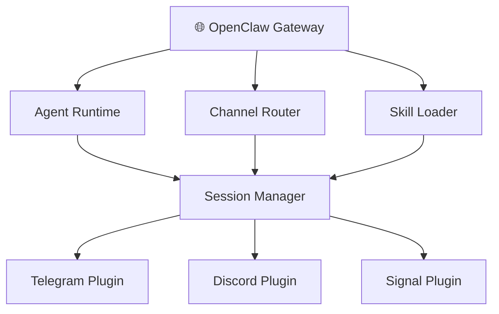
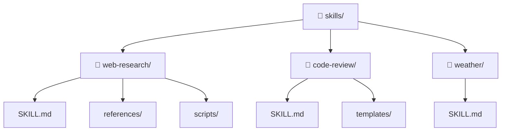

# OpenClaw 深度使用指南

> 最后更新: 2026-03-15 | 分类: AI Agent 平台

---

## Executive Summary

OpenClaw 是一个开源的 AI Agent 编排平台，提供 Agent 运行时、多渠道接入、技能系统和 MCP 集成等能力。与 LangChain/LlamaIndex 等偏重"LLM 调用抽象"的框架不同，OpenClaw 定位更偏向于**Agent 的生产运行时**——关注会话管理、多渠道消息路由、持久化记忆和技能的动态加载。

本文基于 OpenClaw 的公开文档和实际使用经验，提供从架构理解到高级用法的完整指南。

> ⚠️ **说明**: OpenClaw 仍在快速迭代中，部分功能可能随版本变化。建议以官方文档为准。

---

## 1. OpenClaw 架构概览

### 核心设计理念

OpenClaw 的核心设计围绕三个抽象：

1. **Agent**: AI 代理实例，拥有独立的配置、记忆和技能
2. **Channel**: 消息渠道（Telegram、Discord、Signal、HTTP 等）
3. **Session**: 会话上下文，管理 Agent 与用户的交互状态

### 系统架构



### 主要组件

| 组件 | 功能 | 说明 |
|------|------|------|
| **Gateway** | 核心服务 | 管理 Agent 生命周期、路由消息 |
| **Agent Runtime** | Agent 执行环境 | LLM 调用、工具执行、记忆管理 |
| **Channel Router** | 渠道路由 | 将消息路由到对应的 Agent 和会话 |
| **Skill Loader** | 技能加载 | 动态加载和管理 Agent 技能 |
| **Session Manager** | 会话管理 | 持久化会话上下文、记忆 |
| **MCP Client** | MCP 协议客户端 | 连接外部 MCP Server |

---

## 2. 安装与部署

### 2.1 系统要求

| 要求 | 说明 |
|------|------|
| **Node.js** | v20.0+（推荐 v22 LTS） |
| **操作系统** | Linux（推荐）、macOS、Windows（WSL2） |
| **内存** | 最低 512MB，推荐 2GB+ |
| **磁盘** | 200MB+（含依赖和日志） |
| **网络** | 需要访问 LLM API（如 OpenRouter、Anthropic、OpenAI） |

### 2.2 快速安装（5 分钟）

```bash
# 1. 安装 OpenClaw CLI（全局安装）
npm install -g openclaw

# 2. 验证安装
openclaw --version

# 3. 初始化配置向导
openclaw init

# 4. 启动 Gateway 服务
openclaw gateway start
```

`openclaw init` 向导会引导你完成：
- 选择 LLM 提供商（OpenRouter / Anthropic / OpenAI 等）
- 配置 API Key
- 创建第一个 Agent
- 选择消息渠道（Telegram / Discord / HTTP）

### 2.3 从零开始完整安装

#### 步骤 1：安装 Node.js

```bash
# Ubuntu/Debian
curl -fsSL https://deb.nodesource.com/setup_22.x | sudo -E bash -
sudo apt-get install -y nodejs

# macOS (使用 Homebrew)
brew install node@22

# 验证
node --version  # 应输出 v22.x.x
npm --version   # 应输出 10.x.x
```

#### 步骤 2：安装 OpenClaw

```bash
# 全局安装
npm install -g openclaw

# 验证安装
openclaw --version
openclaw help
```

#### 步骤 3：初始化工作区

```bash
# 创建配置目录和工作区
openclaw init

# 这会创建以下目录结构：
# ~/.openclaw/
# ├── config/           # 全局配置
# ├── workspace/        # 默认工作区
# ├── logs/            # 运行日志
# └── skills/          # 技能安装目录
```

#### 步骤 4：配置 LLM 提供商

```bash
# 方法 1：交互式配置（推荐）
openclaw configure

# 方法 2：直接设置环境变量
export OPENROUTER_API_KEY="sk-or-..."
# 或
export ANTHROPIC_API_KEY="sk-ant-..."
# 或
export OPENAI_API_KEY="sk-..."
```

**推荐使用 OpenRouter**：一个 API Key 访问所有主流模型（Claude、GPT、Gemini、Llama 等），自动路由和降级。

#### 步骤 5：配置第一个 Agent

```bash
# 创建 Agent 配置
mkdir -p ~/.openclaw/agents/my-agent

cat > ~/.openclaw/agents/my-agent/agent.yaml << 'EOF'
agent:
  name: my-assistant
  model: openrouter/anthropic/claude-sonnet-4
  system_prompt: |
    你是一个专业、友善的 AI 助手。
  
  tools:
    - web_search
    - read
    - write
    - exec
  
  workspace: /root/.openclaw/workspace
EOF
```

#### 步骤 6：配置消息渠道（以 Telegram 为例）

```bash
# 1. 从 @BotFather 获取 Telegram Bot Token
# 2. 添加 Telegram 插件
openclaw plugin add telegram

# 3. 配置 Token
openclaw configure --section telegram
# 按提示输入 Bot Token

# 4. 设置允许的聊天 ID
# 在 agent.yaml 中添加：
#   channels:
#     - telegram:
#         allowed_chats: [YOUR_CHAT_ID]
```

#### 步骤 7：启动服务

```bash
# 前台运行（开发/调试）
openclaw gateway start --dev

# 后台运行（生产）
openclaw gateway start

# 使用 systemd（Linux 生产环境）
sudo tee /etc/systemd/system/openclaw.service << 'EOF'
[Unit]
Description=OpenClaw Gateway
After=network.target

[Service]
Type=simple
User=root
WorkingDirectory=/root/.openclaw
ExecStart=/usr/bin/openclaw gateway start
Restart=always
RestartSec=5
Environment=NODE_ENV=production

[Install]
WantedBy=multi-user.target
EOF

sudo systemctl enable openclaw
sudo systemctl start openclaw
```

### 2.4 Docker 部署

```dockerfile
FROM node:22-slim

# 安装 OpenClaw
RUN npm install -g openclaw

# 创建配置目录
RUN mkdir -p /root/.openclaw/config /root/.openclaw/workspace

# 复制配置
COPY config/ /root/.openclaw/config/

# 暴露 HTTP 端口
EXPOSE 3000

# 启动
CMD ["openclaw", "gateway", "start"]
```

```bash
# 构建并运行
docker build -t my-openclaw .
docker run -d \
  -p 3000:3000 \
  -e OPENROUTER_API_KEY=sk-or-... \
  -v openclaw-data:/root/.openclaw \
  --name openclaw \
  my-openclaw
```

---

## 3. 入门教程：从零到第一个 Agent

### 3.1 理解核心概念

在开始使用前，理解三个核心抽象：

| 概念 | 类比 | 说明 |
|------|------|------|
| **Agent** | 一个人 | 拥有独立的"性格"（system prompt）、"工具箱"（tools）和"记忆"（memory） |
| **Channel** | 手机号码 | Agent 与外界通信的渠道（Telegram 号码、Discord 频道等） |
| **Session** | 一段对话 | Agent 与某个用户/群组的一次交互上下文 |

### 3.2 第一个对话

```bash
# 1. 确保 Gateway 运行中
openclaw gateway status

# 2. 通过 HTTP API 测试
curl -X POST http://localhost:3000/api/chat \
  -H "Content-Type: application/json" \
  -d '{
    "message": "你好，介绍一下你自己",
    "session": "test-session"
  }'

# 3. 通过 Telegram 测试
# 在 Telegram 中给你的 Bot 发送消息
```

### 3.3 使用工作区（Workspace）

工作区是 Agent 的"工作桌面"，存放文件、笔记、报告等：

```bash
# 查看工作区
ls ~/.openclaw/workspace/

# Agent 可以通过工具读写工作区文件
# - read: 读取文件
# - write: 创建/覆盖文件
# - edit: 精确编辑文件
# - exec: 执行命令

# 常见工作区结构：
# workspace/
# ├── SOUL.md          # Agent "性格"定义
# ├── AGENTS.md        # Agent 行为指南
# ├── USER.md          # 用户偏好
# ├── MEMORY.md        # 长期记忆
# ├── memory/          # 日记
# └── reports/         # 产出物
```

### 3.4 安装和使用技能（Skills）

技能是可复用的能力模块，可以从 ClawHub 社区安装：

```bash
# 搜索技能
clawhub search weather

# 安装技能
clawhub install weather

# 查看已安装技能
clawhub list

# Agent 会自动识别和使用已安装的技能
# 技能定义在 SKILL.md 中，包含触发条件和使用方法
```

### 3.5 使用 MCP 工具

MCP（Model Context Protocol）允许 Agent 连接外部工具和服务：

```bash
# 安装 MCP 插件
openclaw plugin add mcporter

# 添加 MCP Server（以文件系统为例）
openclaw mcp add filesystem \
  --command npx \
  --args "-y,@modelcontextprotocol/server-filesystem,/data"

# 查看已连接的 MCP 工具
openclaw mcp list

# Agent 现在可以读写 /data 目录了
```

### 3.6 Subagent：让 Agent 派生子 Agent

主 Agent 可以 spawn 子 Agent 执行特定任务，结果自动返回：

```
用户: "帮我研究一下 Rust 的内存安全机制，写一份报告"
    ↓
主 Agent: spawn subagent → "研究 Rust 内存安全，写报告"
    ↓
子 Agent: 独立执行研究任务
    ↓
子 Agent 完成 → 结果自动返回给主 Agent
    ↓
主 Agent: 将报告发送给用户
```

---

## 4. Agent 编排与会话管理

### Agent 配置

OpenClaw 的 Agent 通过配置文件定义，核心配置项：

```yaml
# Agent 配置示例
agent:
  name: my-agent
  model: openrouter/anthropic/claude-sonnet-4
  system_prompt: |
    你是一个专业的技术顾问...
  
  # 记忆配置
  memory:
    backend: file          # 或 redis
    max_tokens: 4000
    summarization: true    # 自动摘要
  
  # 工具配置
  tools:
    - web_search
    - read
    - write
    - exec
  
  # 技能目录
  skills:
    - /path/to/skills/
```

### 会话管理

OpenClaw 的会话有以下关键概念：

1. **Session ID**: 唯一标识一个会话，格式通常为 `agent:{name}:{channel}:{chat_id}`
2. **Session Context**: 包含对话历史、用户信息、Agent 状态
3. **Session Memory**: 持久化的记忆，支持自动摘要

**会话隔离策略**:
- **Direct**: 用户私聊，独立会话
- **Group**: 群组共享会话（可配置隔离策略）
- **Thread**: 线程级会话隔离（Telegram topics 等）

### 多 Agent 编排

OpenClaw 支持在同一 Gateway 下运行多个 Agent：

```
# 多 Agent 配置
agents:
  - name: chief-editor
    model: openrouter/anthropic/claude-sonnet-4
    channels:
      - telegram:
          token: ${TELEGRAM_TOKEN}
          allowed_chats: [5967921069]
  
  - name: probe-researcher
    model: openrouter/anthropic/claude-sonnet-4
    channels:
      - http:
          port: 8081
```

**Subagent 机制**: 主 Agent 可以 spawn 子 Agent 执行特定任务，结果自动返回。

---

## 5. 多渠道接入

### 支持的渠道

| 渠道 | 类型 | 特殊功能 |
|------|------|---------|
| **Telegram** | 即时通讯 | Inline buttons、Reaction、Topic |
| **Discord** | 即时通讯 | Slash commands、Embed、Thread |
| **Signal** | 即时通讯 | 端到端加密、Group |
| **WhatsApp** | 即时通讯 | Business API |
| **HTTP API** | REST | 自定义集成 |
| **WebSocket** | 实时 | 自定义前端 |

### Telegram 渠道配置示例

```bash
# 安装 Telegram 插件
openclaw plugin add telegram

# 配置 Token
openclaw configure --section telegram

# 设置允许的聊天
# 在 Agent 配置中指定 allowed_chats
```

### 渠道路由规则

OpenClaw 支持灵活的路由配置：

1. **单 Agent 多渠道**: 一个 Agent 接入多个渠道
2. **多 Agent 单渠道**: 不同用户/群组路由到不同 Agent
3. **条件路由**: 基于消息内容、用户身份、时间等条件路由

---

## 6. 技能系统与 MCP 集成

### 技能系统 (Skills)

OpenClaw 的技能是可复用的能力模块，每个技能是一个目录：



**SKILL.md 示例**:
```markdown
# Weather Skill

## 触发条件
当用户询问天气、温度、预报时激活。

## 使用方法
使用 wttr.in API 获取天气信息:
- 当前天气: curl "wttr.in/{city}?format=j1"
- 格式化输出: curl "wttr.in/{city}?lang=zh"

## 注意事项
- 不需要 API Key
- 支持中文城市名
```

**技能加载机制**: Agent 在处理消息时，扫描可用技能的 SKILL.md，根据描述决定是否加载对应技能。

### MCP 集成

OpenClaw 支持 MCP (Model Context Protocol) 作为工具扩展：

```yaml
# MCP Server 配置
mcp:
  servers:
    - name: filesystem
      command: npx
      args: ["-y", "@modelcontextprotocol/server-filesystem", "/data"]
    
    - name: postgres
      command: npx
      args: ["-y", "@modelcontextprotocol/server-postgres"]
      env:
        DATABASE_URL: ${DATABASE_URL}
```

**MCP vs 内置工具**:
- 内置工具 (read/write/exec): OpenClaw 原生实现，性能好
- MCP 工具: 外部服务，标准化接口，生态丰富

---

## 7. 高级用法与最佳实践

### 5.1 记忆管理优化

```yaml
memory:
  backend: redis           # 推荐生产环境
  max_history: 50          # 保留最近 50 条消息
  summarization: true      # 超出限制时自动摘要
  summary_interval: 20     # 每 20 条消息摘要一次
  cross_session: false     # 是否跨会话共享记忆
```

**最佳实践**:
- 开发阶段用 `file` backend，简单可靠
- 生产环境用 `redis` backend，支持分布式
- 定期导出重要会话的完整上下文

### 5.2 性能调优

1. **模型选择**: 不同任务用不同模型
   ```yaml
   # 主 Agent 用强模型，子 Agent 用轻模型
   agent:
     model: openrouter/anthropic/claude-sonnet-4
     subagents:
       model: openrouter/google/gemini-2.0-flash
   ```

2. **并发控制**:
   ```yaml
   runtime:
     max_concurrent: 10     # 最大并发会话数
     timeout: 120           # 单次调用超时（秒）
     retry: 3               # 重试次数
   ```

3. **缓存策略**:
   ```yaml
   cache:
     enabled: true
     ttl: 3600             # 缓存 1 小时
     backend: redis
   ```

### 5.3 安全实践

1. **API Key 管理**: 使用环境变量或密钥管理服务，不要硬编码
2. **渠道限制**: 设置 `allowed_chats` 限制可访问的用户/群组
3. **工具权限**: 限制 Agent 可执行的命令范围
   ```yaml
   tools:
     exec:
       allowed_commands: ["git", "npm", "python"]
       denied_commands: ["rm -rf", "sudo"]
   ```
4. **输入验证**: 对用户输入进行长度和内容检查

### 5.4 调试技巧

```bash
# 查看 Gateway 状态
openclaw gateway status

# 查看日志
openclaw logs --follow

# 检查 Agent 会话
openclaw sessions list

# 查看特定会话上下文
openclaw sessions view <session-id>

# 导出会话历史
openclaw sessions export <session-id> --format markdown
```

### 5.5 部署建议

**单机部署**:
```bash
# 开发环境
openclaw gateway start --dev

# 生产环境 (systemd)
sudo systemctl enable openclaw
sudo systemctl start openclaw
```

**容器部署**:
```dockerfile
FROM node:22-slim
RUN npm install -g openclaw
COPY config/ /root/.openclaw/config/
EXPOSE 3000
CMD ["openclaw", "gateway", "start"]
```

---

## 8. 故障排查

### 8.1 Gateway 启动失败

| 症状 | 可能原因 | 解决方案 |
|------|----------|----------|
| `EADDRINUSE` 错误 | 端口被占用 | `openclaw gateway stop` 先停止旧进程，或用 `lsof -i :3000` 找占用进程 |
| `EACCES` 权限错误 | 需要 root 权限 | 使用 `sudo` 或配置 systemd 以非 root 用户运行 |
| `MODULE_NOT_FOUND` | 依赖未安装 | 重新安装：`npm install -g openclaw --force` |
| Gateway 启动后无响应 | API Key 未配置 | 检查 `openclaw configure` 或环境变量是否设置正确 |

```bash
# 诊断 Gateway 问题
openclaw gateway status    # 查看状态
openclaw logs --follow     # 实时查看日志
openclaw gateway restart   # 尝试重启
```

### 8.2 Agent 不回复

| 症状 | 可能原因 | 解决方案 |
|------|----------|----------|
| Telegram Bot 无响应 | Chat ID 未授权 | 检查 `allowed_chats` 配置，确认包含你的 Chat ID |
| HTTP API 返回 500 | LLM API 错误 | 检查 API Key 是否有效，余额是否充足 |
| 回复超时 | 模型响应慢 | 增加 `timeout` 配置（默认 120s），或换更快的模型 |
| 回复为空 | System prompt 问题 | 检查 Agent 配置中 `system_prompt` 是否为空 |

```bash
# 查看最近日志中的错误
openclaw logs --level error --limit 50

# 测试 Agent 配置
openclaw agent test my-agent --message "你好"
```

### 8.3 技能（Skills）不生效

| 症状 | 可能原因 | 解决方案 |
|------|----------|----------|
| 安装后技能不生效 | Gateway 未重启 | 运行 `openclaw gateway restart` |
| 技能搜索无结果 | 网络问题 | 检查能否访问 clawhub.com |
| SKILL.md 语法错误 | 格式不正确 | 检查 SKILL.md 是否包含必需的 `# 触发条件` 和 `# 使用方法` 章节 |

### 8.4 MCP 工具连接失败

```bash
# 检查 MCP Server 状态
openclaw mcp list

# 测试 MCP Server 连接
openclaw mcp test <server-name>

# 查看 MCP 日志
openclaw logs --filter mcp

# 常见原因及修复：
# 1. npx 命令未找到 → 确保 Node.js 已正确安装
# 2. 包下载失败 → 检查网络，可配置 npm 镜像
# 3. 权限不足 → 确保 Server 有权访问目标目录/数据库
```

### 8.5 内存/性能问题

| 症状 | 可能原因 | 解决方案 |
|------|----------|----------|
| 内存占用持续增长 | Session 积累 | 设置 `max_history` 限制，启用 `summarization` |
| 响应越来越慢 | 上下文过长 | 启用自动摘要，减少 `max_history` |
| CPU 占用过高 | 并发会话过多 | 降低 `max_concurrent` 配置 |

```yaml
# 优化配置示例
runtime:
  max_concurrent: 5
  timeout: 60
memory:
  max_history: 30
  summarization: true
  summary_interval: 15
```

### 8.6 常用诊断命令速查

```bash
# 系统状态
openclaw gateway status        # Gateway 运行状态
openclaw --version            # 版本信息
openclaw diagnose             # 完整诊断（检查配置、依赖、网络）

# 日志
openclaw logs                  # 查看最近日志
openclaw logs --follow         # 实时跟踪
openclaw logs --level error    # 只看错误
openclaw logs --filter telegram # 按渠道过滤

# 会话
openclaw sessions list         # 活跃会话列表
openclaw sessions view <id>    # 查看会话详情
openclaw sessions kill <id>    # 终止会话

# 配置
openclaw configure             # 交互式配置
openclaw config show           # 查看当前配置
openclaw config validate       # 验证配置合法性
```

### 8.7 社区支持

如果以上方法都无法解决问题：

1. **GitHub Issues**: [github.com/openclaw/openclaw/issues](https://github.com/openclaw/openclaw/issues) — 报告 Bug
2. **Discord 社区**: 实时讨论和技术支持
3. **官方文档**: [docs.openclaw.ai](https://docs.openclaw.ai) — 最新文档

提交 Issue 时请附带：
- `openclaw --version` 输出
- `openclaw diagnose` 结果
- 相关日志（`openclaw logs --level error --limit 30`）
- 复现步骤

---

## 参考来源

1. **OpenClaw 官方文档** — [docs.openclaw.ai](https://docs.openclaw.ai) — 安装、配置、API
2. **OpenClaw GitHub** — [github.com/openclaw/openclaw](https://github.com/openclaw/openclaw) — 源码、Issues、Releases
3. **MCP 协议规范** — [modelcontextprotocol.io](https://modelcontextprotocol.io) — MCP 协议文档
4. **ClawHub 技能市场** — [clawhub.com](https://clawhub.com) — 社区技能分享
5. **OpenClaw Discord 社区** — 社区讨论、技术支持
6. **Anthropic. "Building Effective Agents" (2024)** — 构建 Agent 系统的最佳实践
   - https://www.anthropic.com/engineering/building-effective-agents
7. **Google A2A Protocol (2025)** — Agent-to-Agent 通信协议标准
   - https://github.com/a2aproject/A2A

---

*本指南基于 OpenClaw 公开文档和实际使用经验编写，如有更新请以 [docs.openclaw.ai](https://docs.openclaw.ai) 为准。*
