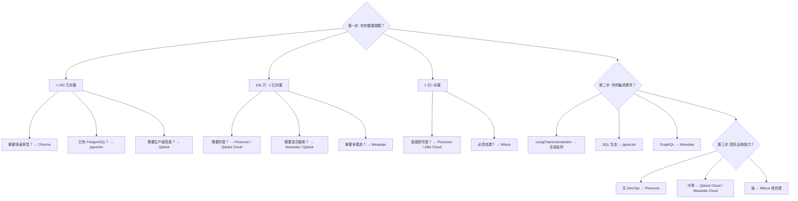

# 向量数据库选型指南 2026

> 最后更新: 2026-03-14 | 分类: 基础设施 / 数据库

---

## Executive Summary

向量数据库是 AI 应用的核心基础设施，支撑 RAG、语义搜索、推荐系统、多模态检索等场景。2025-2026 年，向量数据库市场从"百花齐放"进入"成熟分化"阶段，主要玩家的定位和优势更加清晰。

**本报告对比分析 6 个主流向量数据库**: Pinecone（托管服务标杆）、Weaviate（多模态原生）、Milvus（高性能分布式）、Qdrant（Rust 高性能）、Chroma（轻量嵌入式）、pgvector（PostgreSQL 扩展）。

**核心结论**:
- **企业生产环境**: Pinecone（托管）或 Milvus（自建分布式）
- **开发者快速原型**: Chroma（嵌入式，零配置）或 Qdrant（单机高性能）
- **已有 PostgreSQL**: pgvector（零新增基础设施）
- **多模态搜索**: Weaviate（原生多向量支持）

---

## 1. 各数据库概览

### Pinecone
- **定位**: 全托管向量数据库即服务（Vector DBaaS）
- **语言**: 内部 C++，API REST/gRPC
- **部署**: 仅云端托管（Serverless 架构，2024 年发布）
- **特色**: 零运维、自动扩展、命名空间隔离
- **定价**: 免费层 + 按使用量付费

### Weaviate
- **定位**: 开源多模态向量搜索引擎
- **语言**: Go
- **部署**: 自建 / Weaviate Cloud（托管）
- **特色**: 多模态原生、混合搜索、模块化架构
- **许可**: BSD-3

### Milvus
- **定位**: 高性能分布式向量数据库
- **语言**: Go / C++
- **部署**: 自建 / Zilliz Cloud（托管）
- **特色**: 亿级向量支持、GPU 索引、多租户
- **许可**: Apache 2.0

### Qdrant
- **定位**: 高性能向量搜索引擎
- **语言**: Rust
- **部署**: 自建 / Qdrant Cloud（托管）
- **特色**: 高性能、过滤搜索、稀疏向量支持
- **许可**: Apache 2.0

### Chroma
- **定位**: 轻量级嵌入式向量数据库
- **语言**: Python / Rust
- **部署**: 嵌入式 / 自建服务 / Chroma Cloud（2025 Beta）
- **特色**: 零配置启动、与 LangChain/LlamaIndex 深度集成
- **许可**: Apache 2.0

### pgvector
- **定位**: PostgreSQL 向量搜索扩展
- **语言**: C
- **部署**: 任何 PostgreSQL 实例
- **特色**: 零新增基础设施、SQL 生态、ACID 事务
- **许可**: PostgreSQL License

---

## 2. 性能基准测试

以下数据综合自多个独立基准测试（ANN Benchmarks、Qdrant Benchmark、VectorDBBench），在 100 万条 768 维向量、top-10 查询场景下的典型表现：

### 查询延迟 (P95, 单线程)

| 数据库 | 查询延迟 (ms) | QPS (单节点) | 备注 |
|--------|--------------|-------------|------|
| Qdrant | 2-5 | 3,000-5,000 | HNSW 索引，Rust 实现 |
| Milvus | 3-8 | 2,000-4,000 | IVF_PQ 索引，分布式 |
| Weaviate | 5-12 | 1,500-3,000 | HNSW 索引 |
| Pinecone | 10-30 | N/A (托管) | 网络延迟 + 服务端 |
| Chroma | 15-50 | 500-1,000 | 嵌入式模式 |
| pgvector | 20-100 | 300-800 | HNSW/IVFFlat |

> ⚠️ **注意**: 基准测试结果高度依赖硬件、索引参数、数据分布和查询模式。上述数据为典型场景参考，不代表绝对性能。

### 索引构建时间 (1M 768d 向量)

| 数据库 | 构建时间 | 内存占用 |
|--------|---------|---------|
| Qdrant | 3-8 分钟 | ~4 GB |
| Milvus | 5-15 分钟 | ~6 GB (IVF_PQ 压缩后 ~1.5 GB) |
| Weaviate | 8-20 分钟 | ~5 GB |
| Chroma | 10-30 分钟 | ~4 GB |
| pgvector | 15-60 分钟 | ~3 GB (取决于索引类型) |
| Pinecone | N/A (托管，无需管理) | N/A |

### 可扩展性

| 数据库 | 最大向量规模 | 分布式 | 多租户 |
|--------|------------|--------|--------|
| Milvus | 10 亿+ | ✅ 原生分布式 | ✅ Collection 级 |
| Pinecone | 数十亿 | ✅ 自动扩展 | ✅ Namespace |
| Qdrant | 数亿 | ✅ 分片 + 副本 | ✅ Collection 级 |
| Weaviate | 数亿 | ✅ 分片 | ✅ 多租户模块 |
| Chroma | 百万级 | ❌ (计划中) | ❌ |
| pgvector | 千万级 (单表) | ❌ (依赖 PG 分片) | ✅ Schema 级 |

---

## 3. 部署模式对比

### 托管服务 (Managed)

| 数据库 | 托管服务 | 免费层 | 起步价 |
|--------|---------|--------|--------|
| Pinecone | Pinecone Cloud | ✅ (有限) | ~$70/月 |
| Weaviate | Weaviate Cloud | ✅ (Sandbox) | ~$25/月 |
| Milvus | Zilliz Cloud | ✅ (有限) | ~$65/月 |
| Qdrant | Qdrant Cloud | ✅ (1GB free) | ~$25/月 |
| Chroma | Chroma Cloud (Beta) | ✅ (有限) | TBD |
| pgvector | 任意 PG 托管 | 取决于 PG | $15+/月 |

### 自建部署

| 数据库 | 单机部署 | Docker | K8s Operator | 最低配置 |
|--------|---------|--------|-------------|---------|
| Milvus | ✅ (Milvus Lite) | ✅ | ✅ (官方) | 8GB RAM |
| Qdrant | ✅ (单二进制) | ✅ | ✅ (官方) | 2GB RAM |
| Weaviate | ✅ | ✅ | ✅ (Helm) | 4GB RAM |
| Chroma | ✅ (pip install) | ✅ | ❌ | 1GB RAM |
| pgvector | ✅ (PG extension) | ✅ (PG 镜像) | 取决于 PG | 2GB RAM |
| Pinecone | ❌ | ❌ | ❌ | N/A |

**部署建议**:
- **小团队/原型**: Chroma (pip install) → 最快上手
- **中等规模**: Qdrant 单机 → 高性能、资源占用小
- **大规模生产**: Milvus 分布式或 Pinecone 托管
- **已有 PostgreSQL**: pgvector → 无需额外运维

---

## 4. 混合检索能力

现代 RAG 应用越来越依赖**混合搜索**（Hybrid Search）——结合向量语义搜索和关键词精确搜索。

### 混合搜索支持

| 数据库 | 向量搜索 | 关键词搜索 | 混合搜索 | 原生支持 |
|--------|---------|----------|---------|---------|
| Weaviate | ✅ | ✅ (BM25) | ✅ 融合排名 | ✅ 原生 |
| Milvus | ✅ | ✅ (Sparse) | ✅ 融合搜索 | ✅ 原生 |
| Qdrant | ✅ | ✅ (Sparse) | ✅ 融合搜索 | ✅ 原生 |
| Pinecone | ✅ | ✅ (Sparse) | ✅ 混合查询 | ✅ 原生 |
| pgvector | ✅ | ✅ (PG 全文搜索) | ✅ (手动合并) | ⚠️ 需开发 |
| Chroma | ✅ | ❌ | ❌ | ❌ |

### 过滤搜索 (Filtered Search)

在向量搜索的同时应用元数据过滤是生产场景的刚需：

- **Qdrant**: 业界领先的过滤搜索性能，支持丰富的过滤条件（范围、集合、地理位置）
- **Milvus**: 支持布尔表达式过滤，性能优异
- **Weaviate**: GraphQL 风格的 where 过滤，表达力强
- **Pinecone**: 基于元数据的过滤，语法简洁
- **pgvector**: 原生 SQL WHERE 子句，表达力最强
- **Chroma**: 基础的 where 过滤

### 多向量/多模态支持

- **Weaviate**: ⭐ 原生多向量支持（同一对象多个向量，如文本+图像）
- **Milvus**: 支持多向量字段
- **Qdrant**: 支持 Named Vectors（同一 Point 多个命名向量）
- **Pinecone**: 2025 年新增 Sparse+Dense 混合
- **pgvector / Chroma**: 基本不支持

---

## 5. 选型决策树


```

---

## 6. 2025-2026 趋势观察

1. **Serverless 化**: Pinecone Serverless 引领趋势，其他厂商跟进
2. **稀疏+稠密混合**: 成为标配能力（2024-2025 年实现）
3. **GPU 索引加速**: Milvus、Qdrant 开始支持 GPU 加速的索引构建
4. **向量搜索"商品化"**: PostgreSQL (pgvector)、Redis、Elasticsearch 等传统数据库纷纷加入向量搜索能力
5. **多模态原生**: Weaviate 引领多模态向量搜索方向
6. **边缘部署**: 轻量级方案（Chroma、Qdrant 单机）在边缘/本地部署场景增长

---

## 参考来源

1. **ANN Benchmarks** — [ann-benchmarks.com](https://ann-benchmarks.com) — 向量搜索性能基准测试
2. **VectorDBBench** — [github.com/zilliz-tool/VectorDBBench](https://github.com/zilliz-tool/VectorDBBench) — Zilliz 出品的综合基准
3. **Qdrant Benchmarks** — [qdrant.tech/benchmarks/](https://qdrant.tech/benchmarks/) — Qdrant 官方性能测试
4. **各数据库官方文档** — Pinecone / Weaviate / Milvus / Qdrant / Chroma / pgvector 官方文档
5. **DB-Engines Vector Database Ranking** — [db-engines.com](https://db-engines.com) — 数据库流行度趋势
6. **LangChain Vector Store Integration Docs** — [python.langchain.com/docs/integrations/vectorstores/](https://python.langchain.com/docs/integrations/vectorstores/) — 集成支持矩阵
